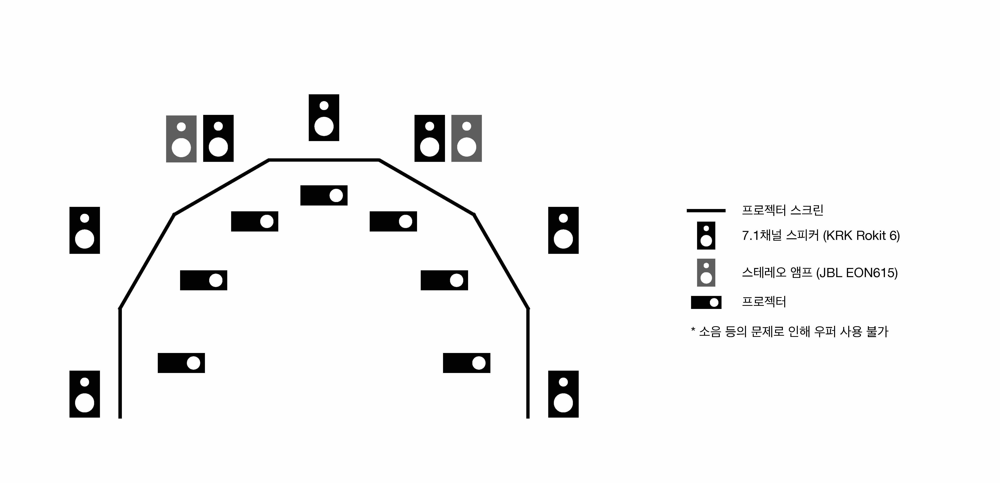
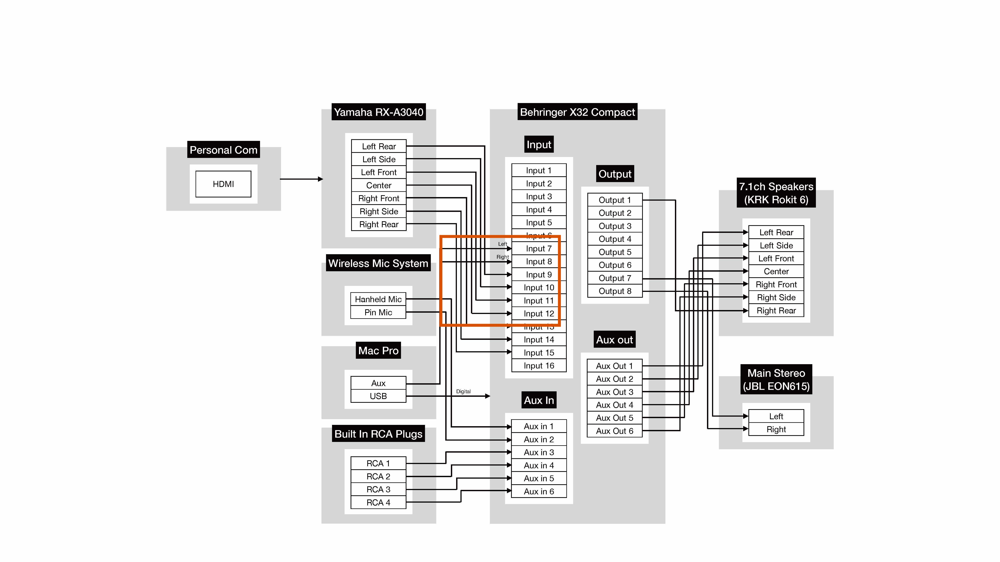
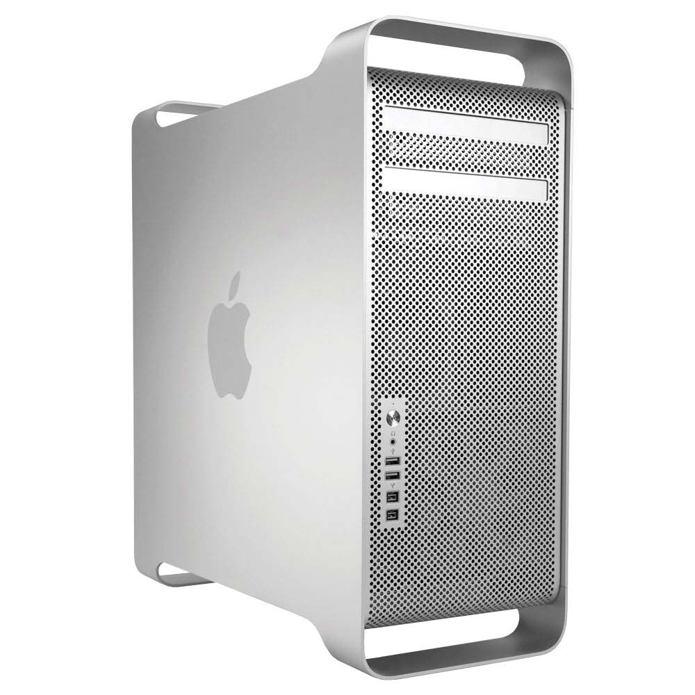
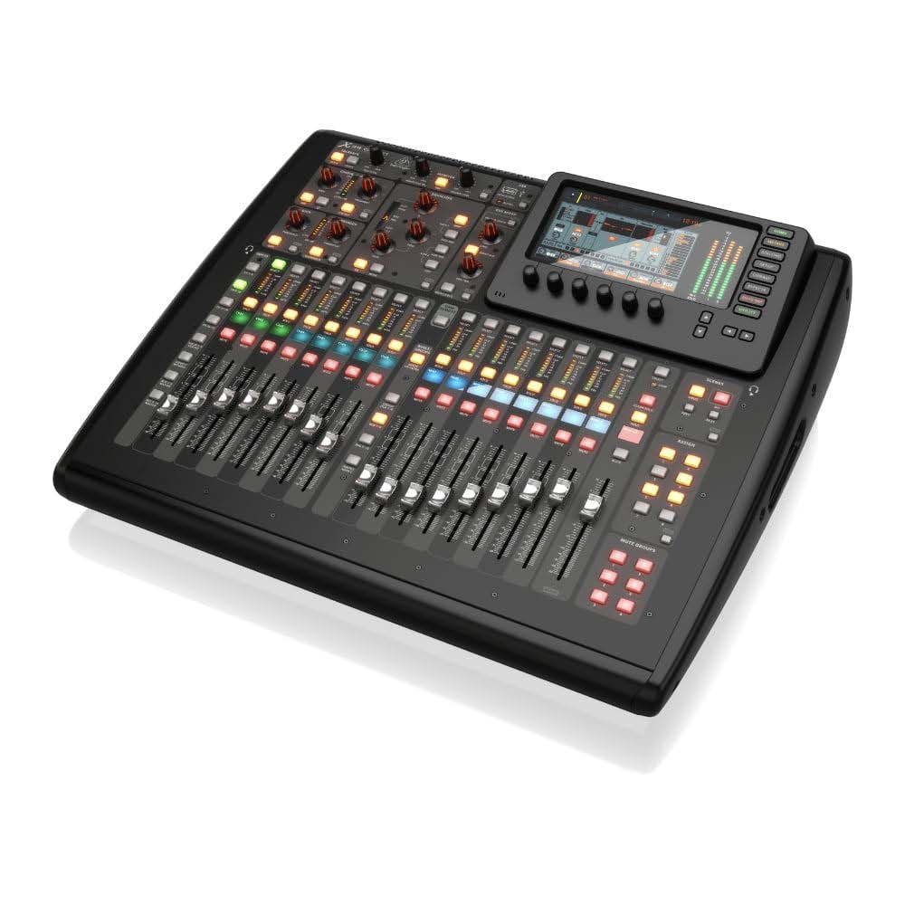
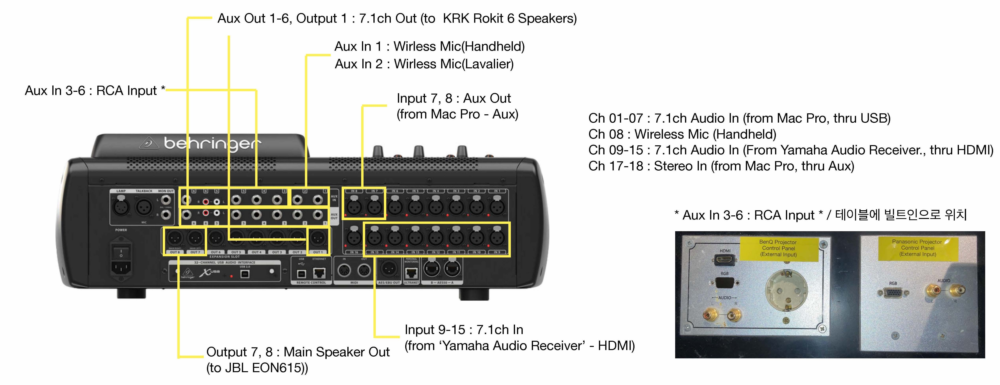

# 신영균 프로젝션 사용 매뉴얼

## 1. 시스템 구조

## 2. 보유 기자재
| 구분                 | 장치명                   |기능|
|--------------------|-----------------------|--|
| PC                 | Mac Pro(Mid 2012)     | - 신영균 스튜디오 메인 컨트롤 PC   - 7채널 멀티스크린 프로젝션, 7.1채널 음향 및 2채널 스테레오 음향 송출|
| Audio Mixer        | Behringer X32 Compact | - 7.1채널 음향, 2채널 스테레오 음향, 사운드 리시버를 통한 7.1채널 음향, 마이크 사용 등 모든 음향 기기 제어|
| Speaker1           | KRK Rokit 6           | - PC, 사운드 리시버를 통한 7.1채널 음향 출력|
| Speaker2           | JBL EON615            | - PC에서 출력되는 2채널 스테레오 음향 출력 (USB 연결과 Aux 라인연결로 모두 출력 가능)|
| Sound Receiver     | Yamaha RX-A3034       |- 신영균 스튜디오에 비치된 PC가 아닌 외부 컴퓨터/노트북을 통한 7.1채널 음향 송출 시 사용   - 책상 위로 나와있는 HDMI 케이블을 통해 연결|
| Wireless Mic Receiver | SECO DX-330           | - 신영균 스튜디오에서 사용할 수 있는 무선마이크의 수신기로 핸드 마이크와 핀 마이크, 총 2개에 연결 가능 |
| Wireless Mic1      | Handheld Mic          |- 손으로 잡고 쓸 수 있는 핸드 마이크 |
| Woreless Mic2      | Pin Mic               | - 몸에 부착할 수 있는 핀 마이크|

### - PC / Mac Pro (Mid 2012)

#### 컴퓨터 사양

- CPU: Intel Xeon E5645 * 2
- RAM: 32GB DDR3-1333 ECC
- VGA: NVIDIA NVS810 D3 4GB (Mini DP * 8)

### - Audio Mixer / Behringer X32 Compact

- Analog Input : 16ch XLR Input, 8ch Aux In(TRS)
- Analog Output : 8ch XLR Output, 8ch Aux Out(TRS)
- USB Audio Interface : 32 X 32 ch
- Manual : https://mediadl.musictribe.com/media/sys_master/h1f/h56/8849797021726.pdf

**임의로 바꿔 사용할 시 해당 채널 세팅 원복 필수**

|Ch No. |Input (Trim)| Sned (Send Level) |Output |Audio|
|---|----|---|---|---|
|1| Card 6 (—18dB)| Bus 1 (-20dB)| Aux Out 1- Left Rear / Main |7.1ch Sound from Mac(USB)|
|2| Card 4 (—18dB)| Bus 2 (-20dB)| Aux Out 2 - Left Side / Main |7.1ch Sound from Mac(USB)|
|3| Card 1 (—18dB)| Bus 3 (-20dB)| Aux Out 3 - Left Front / Main |7.1ch Sound from Mac(USB)|
|4|Card 3 (—18dB)| Bus 4 (-20dB)| Aux Out 4 - Center / Main 7.1ch |Sound from Mac(USB)|
|5| Card 2 (—18dB)| Bus 5 (-20dB)| Aux Out 5 - Right Front / Main |7.1ch Sound from Mac(USB)|
|6| Card 5 (—18dB)| Bus 6 (-20dB)| Aux Out 6 - Right Side / Main |7.1ch Sound from Mac(USB)|
|7| Card 7 (—18dB)| Bus 7 (-20dB)| Aux Out 7 - Right Rear / Main |7.1ch Sound from Mac(USB)|
|8| Aux In 1 (+11.5dB)| Bus 1-7 (0dB)| Aux Out 1-7 - 7.1ch Speakers / Main |Wireless Handheld Mic|
|9| Input 1 (0dB)| Bus 1 (0dB)| Aux Out 1- Left Rear / Main |7.1ch Sound from Sound Receiver|
|10| Input 2 (0dB)| Bus 2 (0dB)| Aux Out 2 - Left Side / Main |7.1ch Sound from Sound Receiver|
|11| Input 3 (0dB)| Bus 3 (0dB)| Aux Out 3 - Left Front / Main |7.1ch Sound from Sound Receiver|
|12| Input 4 (0dB)| Bus 4 (0dB)| Aux Out 4 - Center / Main |7.1ch Sound from Sound Receiver|
|13| Input 5 (0dB)| Bus 5 (0dB)| Aux Out 5 - Right Front / Main |7.1ch Sound from Sound Receiver|
|14| Input 6 (0dB)| Bus 6 (0dB)| Aux Out 6 - Right Side / Main |7.1ch Sound from Sound Receiver|
|15| Input 7 (0dB)| Bus 7 (0dB)| Aux Out 7 - Right Rear / Main |7.1ch Sound from Sound Receiver|
|17| Input 7 (+34dB)|| Main |Stereo Sound from Mac(3.5mm Aux)
|18| Input 8 (+34dB)|| Main |Stereo Sound from Mac(3.5mm Aux)

#### Default Setting
Ch 08 : Wireless Mic (Handheld)
- Dynamic (Comp)

| hreshold | -32.5 / Active|
|----------|---|
| Ratio    |3.0 / Comp|
| Attach   |10ms / Peak|
| Hold     | 10.0ms / Log|
| Release  |151ms|
| Gain     |0.00|