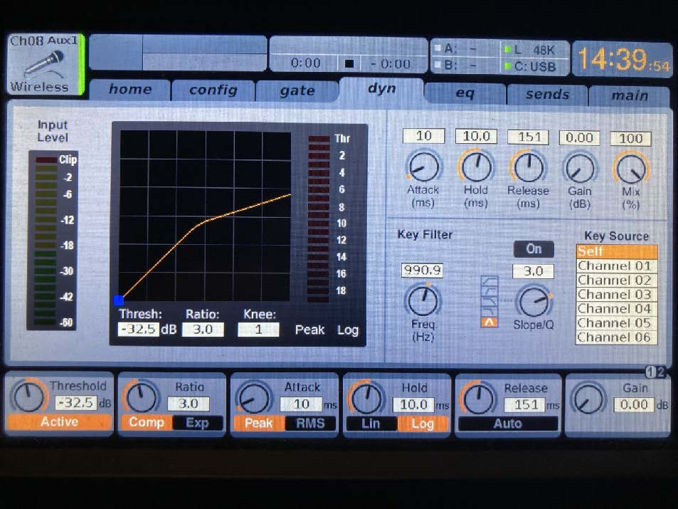
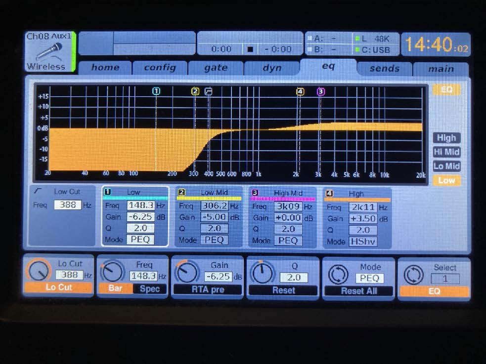
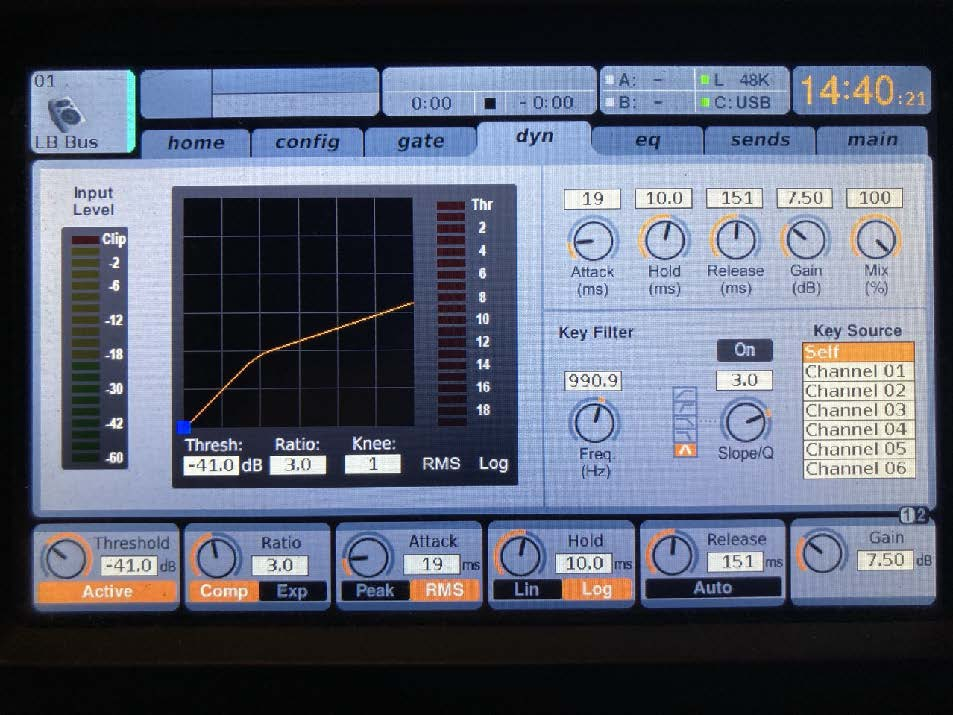
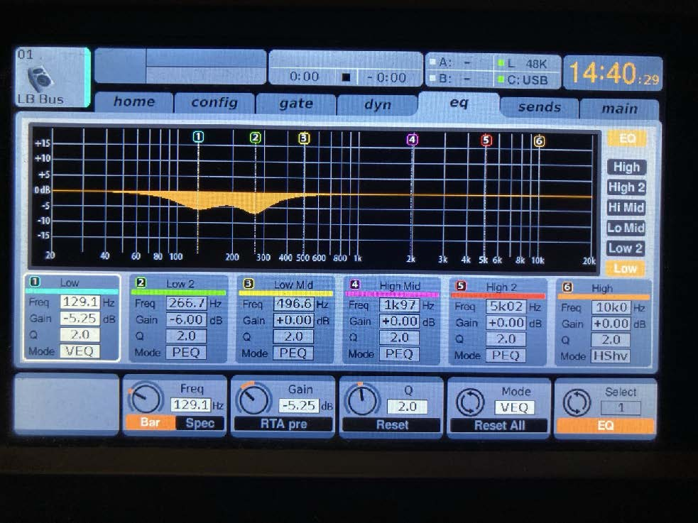
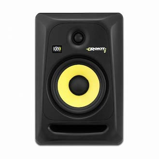
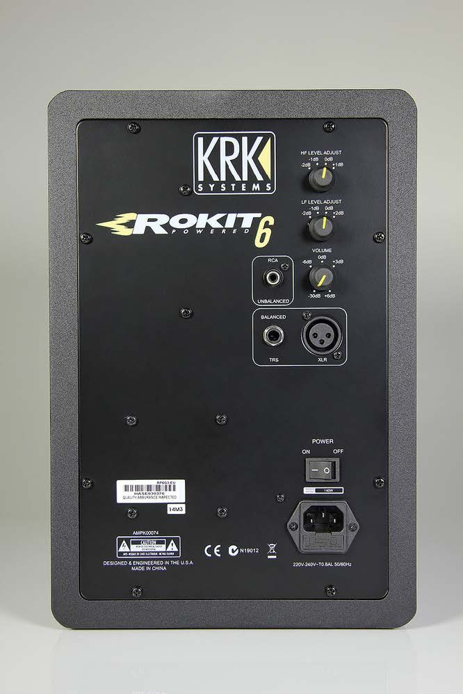
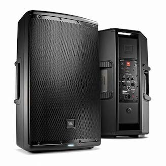
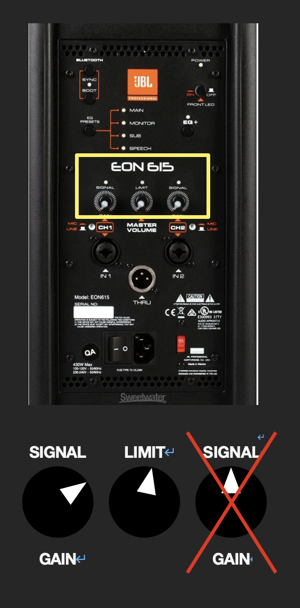
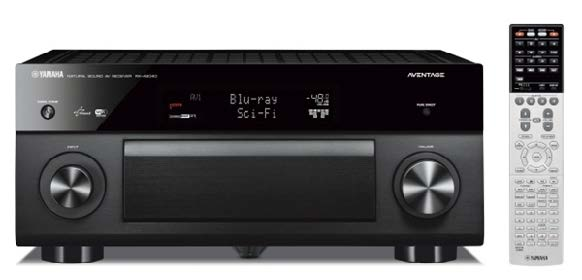

# 신영균 프로젝션 사용 매뉴얼

## 1. 시스템 구조

## 2. 보유 기자재
| 구분                 | 장치명                   |기능|
|--------------------|-----------------------|--|
| PC                 | Mac Pro(Mid 2012)     | - 신영균 스튜디오 메인 컨트롤 PC   - 7채널 멀티스크린 프로젝션, 7.1채널 음향 및 2채널 스테레오 음향 송출|
| Audio Mixer        | Behringer X32 Compact | - 7.1채널 음향, 2채널 스테레오 음향, 사운드 리시버를 통한 7.1채널 음향, 마이크 사용 등 모든 음향 기기 제어|
| Speaker1           | KRK Rokit 6           | - PC, 사운드 리시버를 통한 7.1채널 음향 출력|
| Speaker2           | JBL EON615            | - PC에서 출력되는 2채널 스테레오 음향 출력 (USB 연결과 Aux 라인연결로 모두 출력 가능)|
| Sound Receiver     | Yamaha RX-A3034       |- 신영균 스튜디오에 비치된 PC가 아닌 외부 컴퓨터/노트북을 통한 7.1채널 음향 송출 시 사용   - 책상 위로 나와있는 HDMI 케이블을 통해 연결|
| Wireless Mic Receiver | SECO DX-330           | - 신영균 스튜디오에서 사용할 수 있는 무선마이크의 수신기로 핸드 마이크와 핀 마이크, 총 2개에 연결 가능 |
| Wireless Mic1      | Handheld Mic          |- 손으로 잡고 쓸 수 있는 핸드 마이크 |
| Woreless Mic2      | Pin Mic               | - 몸에 부착할 수 있는 핀 마이크|
------------
### - PC / Mac Pro (Mid 2012)

#### 컴퓨터 사양

- CPU: Intel Xeon E5645 * 2
- RAM: 32GB DDR3-1333 ECC
- VGA: NVIDIA NVS810 D3 4GB (Mini DP * 8)
------------
### - Audio Mixer / Behringer X32 Compact

- Analog Input : 16ch XLR Input, 8ch Aux In(TRS)
- Analog Output : 8ch XLR Output, 8ch Aux Out(TRS)
- USB Audio Interface : 32 X 32 ch
- Manual : https://mediadl.musictribe.com/media/sys_master/h1f/h56/8849797021726.pdf

**임의로 바꿔 사용할 시 해당 채널 세팅 원복 필수**

|Ch No. |Input (Trim)| Sned (Send Level) |Output |Audio|
|---|----|---|---|---|
|1| Card 6 (—18dB)| Bus 1 (-20dB)| Aux Out 1- Left Rear / Main |7.1ch Sound from Mac(USB)|
|2| Card 4 (—18dB)| Bus 2 (-20dB)| Aux Out 2 - Left Side / Main |7.1ch Sound from Mac(USB)|
|3| Card 1 (—18dB)| Bus 3 (-20dB)| Aux Out 3 - Left Front / Main |7.1ch Sound from Mac(USB)|
|4|Card 3 (—18dB)| Bus 4 (-20dB)| Aux Out 4 - Center / Main 7.1ch |Sound from Mac(USB)|
|5| Card 2 (—18dB)| Bus 5 (-20dB)| Aux Out 5 - Right Front / Main |7.1ch Sound from Mac(USB)|
|6| Card 5 (—18dB)| Bus 6 (-20dB)| Aux Out 6 - Right Side / Main |7.1ch Sound from Mac(USB)|
|7| Card 7 (—18dB)| Bus 7 (-20dB)| Aux Out 7 - Right Rear / Main |7.1ch Sound from Mac(USB)|
|8| Aux In 1 (+11.5dB)| Bus 1-7 (0dB)| Aux Out 1-7 - 7.1ch Speakers / Main |Wireless Handheld Mic|
|9| Input 1 (0dB)| Bus 1 (0dB)| Aux Out 1- Left Rear / Main |7.1ch Sound from Sound Receiver|
|10| Input 2 (0dB)| Bus 2 (0dB)| Aux Out 2 - Left Side / Main |7.1ch Sound from Sound Receiver|
|11| Input 3 (0dB)| Bus 3 (0dB)| Aux Out 3 - Left Front / Main |7.1ch Sound from Sound Receiver|
|12| Input 4 (0dB)| Bus 4 (0dB)| Aux Out 4 - Center / Main |7.1ch Sound from Sound Receiver|
|13| Input 5 (0dB)| Bus 5 (0dB)| Aux Out 5 - Right Front / Main |7.1ch Sound from Sound Receiver|
|14| Input 6 (0dB)| Bus 6 (0dB)| Aux Out 6 - Right Side / Main |7.1ch Sound from Sound Receiver|
|15| Input 7 (0dB)| Bus 7 (0dB)| Aux Out 7 - Right Rear / Main |7.1ch Sound from Sound Receiver|
|17| Input 7 (+34dB)|| Main |Stereo Sound from Mac(3.5mm Aux)
|18| Input 8 (+34dB)|| Main |Stereo Sound from Mac(3.5mm Aux)
-----------------
#### Default Setting
Ch 08 : Wireless Mic (Handheld)
#### Dynamic (Comp)
  

| Threshold | -32.5 / Active|
|-----------|---|
| Ratio     |3.0 / Comp|
| Attach    |10ms / Peak|
| Hold      | 10.0ms / Log|
| Release   |151ms|
| Gain      |0.00|

#### Channel EQ

- LOW CUT

| Freq|388|
|---|---|
|||
|||
|||

- EQ 1

| Freq | 148.3 |
|------|-------|
| Gain | -6.25 |
| Q    | 2.0   |
| Mode | PEQ   |

- EQ 2

| Freq | 306.2 |
|------|-------|
| Gain | -5.00 |
| Q    | 2.0   |
| Mode | PEQ   |

- EQ 3

| Freq | 3k09 |
|------|------|
| Gain | 0.00 |
| Q    | 2.0  |
| Mode | PEQ  |

--
--

#### Default Setting
Bus 1-7: 7.1ch Bus
#### Dynamic (Comp)

| Threshold | -41.0 / Active |
|-----------|----------------|
| Ratio     | 3.0 / Comp     |
| Attach    | 19ms / Peak    |
| Hold      | 10.0ms / Log   |
| Release   | 151ms          |
| Gain      | 0.00           |

#### Channel EQ

- EQ 1

| Freq | 129.1 |
|------|-------|
| Gain | -5.25 |
| Q    | 2.0   |
| Mode | VEQ   |

- EQ 2

| Freq | 266.7 |
|------|-------|
| Gain | -6.00 |
| Q    | 2.0   |
| Mode | PEQ   |

------------

### Speakers / KRK Rokit 6, JBL EON615
#### KRK Rokit 6

- HF LEVEL ADJUST : 0dB
- LF LEVEL ADJUST : 0dB
- VOLUME : 0dB (사진과 다름)
#### JBL EON 615

-----------

### Sound Receiver / Yamaha RX-A3040

- Manual : https://europe.yamaha.com/en/products/audio_visual/av_receivers_amps/rx-a3040/downloads.html

#### 사용 방법

- **시스템 on/off**

  - **<On 방법>**
    1. 콘솔 데스크로 이동한다
    2. 콘솔 데스크 우측 하단 랙의 최하단에 설치된 순차전원기(SP-8S)의 오른쪽에 위치한 시스템 전원을 On으로 킨다.
    3. 순차전원기의 LED 상태등이 모두 빨간색으로 바뀔 때까지 기다린다.
       -	**연결된 장비 목록**
         *	Audio Mixer / Behringer X32 Compact
         *	Sound Receiver / Yamaha RX-A3040
         *	Speaker / KRK Rokit 6
         *    Speaker / JBL EON615
       *	프로젝터 원격 조작 시스템 및 프로젝터
    4.	콘솔 데스크에 설치된 순차전원기의 LED 상태등이 모두 빨간색으로 바뀌면 스튜디오 뒤편에 있는 두 번째 순차전원기의 전원이 들어오니 잠시 기다린다.
    5.	콘솔 데스크 하단에 위치한 PC(Mac Pro)의 전원을 키고 사용한다.

  - **<Off 방법>**
    1.	콘솔 데스크 하단에 위치한 PC(Mac Pro)의 전원을 끈다.
    2.	PC의 전원이 완전히 꺼진 후 콘솔 데스크 우측 하단 랙의 최하단에 설치된 순차전원기(SP-8S)의 오른쪽에 위치한 시스템 전원을 Off로 끈다.
    3.	순차전원기의 LED 상태등이 모두 빨간색으로 바뀔 때까지 기다린다.

- **7.1	채널 사운드 사용법 / 믹서 사용 시**
  1.	콘솔 데스크에 위치한 PC(Mac Pro)의 전원을 키고 Student 계정으로 로그인한다.
  2.	로그인 후 바탕화면 우측 상단에 위치한 툴바에서 스피커 모양의 아이콘을 클릭한다.
  3.	아이콘을 클릭하면 나타나는 [출력 기기] 선택 옵션에서 [X-USB]를 선택한다.
  4.	출력 기기를 [X-USB]로 선택한 후 오디오 믹서의 왼쪽에 위치한 버튼 중 [CH 1-8] 버튼을 눌러 초록색 불이 들어오는 것을 확인한다.
  5.	[CH 1-8] 버튼에 초록색 불이 들어온 것을 확인하고 CH1부터 CH7까지의 페이더를 모두 끝까지 올린다.
     *	해당 페이더를 끝까지 올려 사용하는 것은 사람의 손으로 모든 페이더를 같은 레벨로 설정하는 것이 불가능하기에 모두 최대값으로 레벨을 통일하는 것이다.
  6.	오디오 믹서의 오른쪽 끝에 위치한 [MAIN] 페이더가 끝까지 내려가 있는지 확인한다.
  *	페이더 내려가있지 않을 경우 재생되는 음원이 2채널 스테레오 앰프(JBL EON615)에서도 재생되어 온전한 7.1채널 사용이 불가하다.
  7.	오디오 믹서 중앙에 위치한 버튼 중 [Group DCA 1-8] 버튼을 눌러 초록색 불이 들어오는 것을 확인한다.
  8.	[Group DCA 1-8] 버튼에 초록색 불이 들어온 것을 확인하고 오디오 믹서의 오른쪽에 위치한 페이더들 중 1번부터 7번까지의 페이더를 끝까지 올린다.
  *	해당 페이더를 끝까지 올려 사용하는 것은 사람의 손으로 모든 페이더를 같은 레벨로 설정하는 것이 불가능하기에 모두 최대값으로 레벨을 통일하는 것이다.
  9.	해당 페이더가 모두 올라가 있는 것을 확인한 후 원하는 음원 및 프로젝트를 실행한다.

- **7.1	채널 사운드 사용법 / 믹서 사용 시 문제해결 방법**
*	**출력되는 소리가 너무 크거나 작을 경우**
  -	**방법 1** : 사용하는 컴퓨터/노트북에서 출력 오디오 레벨을 조절한다.
  -	**방법 2** : 콘솔 데스크 오른쪽 하단 랙에 설치된 사운드 리시버 [Yamaha RX-A3040]의 오른쪽에 위치한 [Volume] 노브를 돌려 음량을 조절한다. (오디오 믹서에서 조절할 경우 각 채널 사이에 오차가 발생해 온전한 7.1채널 사용이 불가하다.)

  *	**재생이 안될 경우 1**
       
  * (아래 단계를 수행하기 앞서 오디오 콘솔에서 CH9-15과 Group DCA 1-7 중 [MUTE] 된 채널이 없는지 확인 / [MUTE] 버튼에 빨간색 불이 들어온 경우 Mute 된 것)
1.	사운드 리시버의 왼쪽 하단에 위치한 [INPUT] 노브를 돌려 디스플레이를 확인하며 [MULTI CH]로 설정한다.
2.	원하는 음원 및 프로젝트를 실행한다.
