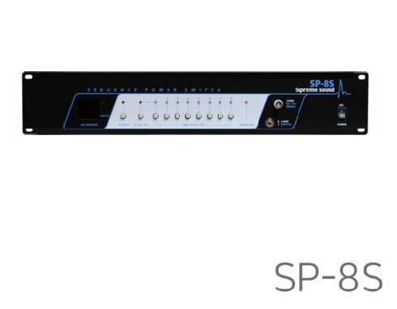

# 신영균 프로젝션 사용 매뉴얼

## 1. 시스템 구조

## 2. 보유 기자재
| 구분                 | 장치명                   | 기능                                                                                       |
|--------------------|-----------------------|------------------------------------------------------------------------------------------|
| PC                 | Mac Pro(Mid 2012)     | - 신영균 스튜디오 메인 컨트롤 PC   - 7채널 멀티스크린 프로젝션, 7.1채널 음향 및 2채널 스테레오 음향 송출                    |
| Audio Mixer        | Behringer X32 Compact | - 7.1채널 음향, 2채널 스테레오 음향, 사운드 리시버를 통한 7.1채널 음향, 마이크 사용 등 모든 음향 기기 제어                      |
| Speaker1           | KRK Rokit 6           | - PC, 사운드 리시버를 통한 7.1채널 음향 출력                                                            |
| Speaker2           | JBL EON615            | - PC에서 출력되는 2채널 스테레오 음향 출력 (USB 연결과 Aux 라인연결로 모두 출력 가능)                                  |
| Sound Receiver     | Yamaha RX-A3034       | - 신영균 스튜디오에 비치된 PC가 아닌 외부 컴퓨터/노트북을 통한 7.1채널 음향 송출 시 사용   - 책상 위로 나와있는 HDMI 케이블을 통해 연결 |
| Wireless Mic Receiver | SECO DX-330           | - 신영균 스튜디오에서 사용할 수 있는 무선마이크의 수신기로 핸드 마이크와 핀 마이크, 총 2개에 연결 가능                             |
| Wireless Mic1      | Handheld Mic          | - 손으로 잡고 쓸 수 있는 핸드 마이크                                                                   |
| Woreless Mic2      | Pin Mic               | - 몸에 부착할 수 있는 핀 마이크                                                                      |

------------

### - PC / Mac Pro (Mid 2012)

#### 컴퓨터 사양

- CPU: Intel Xeon E5645 * 2
- RAM: 32GB DDR3-1333 ECC
- VGA: NVIDIA NVS810 D3 4GB (Mini DP * 8)
------------
### - Audio Mixer / Behringer X32 Compact

- Analog Input : 16ch XLR Input, 8ch Aux In(TRS)
- Analog Output : 8ch XLR Output, 8ch Aux Out(TRS)
- USB Audio Interface : 32 X 32 ch
- Manual : https://mediadl.musictribe.com/media/sys_master/h1f/h56/8849797021726.pdf

**임의로 바꿔 사용할 시 해당 채널 세팅 원복 필수**

|Ch No. |Input (Trim)| Sned (Send Level) |Output |Audio|
|---|----|---|---|---|
|1| Card 6 (—18dB)| Bus 1 (-20dB)| Aux Out 1- Left Rear / Main |7.1ch Sound from Mac(USB)|
|2| Card 4 (—18dB)| Bus 2 (-20dB)| Aux Out 2 - Left Side / Main |7.1ch Sound from Mac(USB)|
|3| Card 1 (—18dB)| Bus 3 (-20dB)| Aux Out 3 - Left Front / Main |7.1ch Sound from Mac(USB)|
|4|Card 3 (—18dB)| Bus 4 (-20dB)| Aux Out 4 - Center / Main 7.1ch |Sound from Mac(USB)|
|5| Card 2 (—18dB)| Bus 5 (-20dB)| Aux Out 5 - Right Front / Main |7.1ch Sound from Mac(USB)|
|6| Card 5 (—18dB)| Bus 6 (-20dB)| Aux Out 6 - Right Side / Main |7.1ch Sound from Mac(USB)|
|7| Card 7 (—18dB)| Bus 7 (-20dB)| Aux Out 7 - Right Rear / Main |7.1ch Sound from Mac(USB)|
|8| Aux In 1 (+11.5dB)| Bus 1-7 (0dB)| Aux Out 1-7 - 7.1ch Speakers / Main |Wireless Handheld Mic|
|9| Input 1 (0dB)| Bus 1 (0dB)| Aux Out 1- Left Rear / Main |7.1ch Sound from Sound Receiver|
|10| Input 2 (0dB)| Bus 2 (0dB)| Aux Out 2 - Left Side / Main |7.1ch Sound from Sound Receiver|
|11| Input 3 (0dB)| Bus 3 (0dB)| Aux Out 3 - Left Front / Main |7.1ch Sound from Sound Receiver|
|12| Input 4 (0dB)| Bus 4 (0dB)| Aux Out 4 - Center / Main |7.1ch Sound from Sound Receiver|
|13| Input 5 (0dB)| Bus 5 (0dB)| Aux Out 5 - Right Front / Main |7.1ch Sound from Sound Receiver|
|14| Input 6 (0dB)| Bus 6 (0dB)| Aux Out 6 - Right Side / Main |7.1ch Sound from Sound Receiver|
|15| Input 7 (0dB)| Bus 7 (0dB)| Aux Out 7 - Right Rear / Main |7.1ch Sound from Sound Receiver|
|17| Input 7 (+34dB)|| Main |Stereo Sound from Mac(3.5mm Aux)|
|18| Input 8 (+34dB)|| Main |Stereo Sound from Mac(3.5mm Aux)|
-----------------
#### Default Setting
Ch 08 : Wireless Mic (Handheld)
#### Dynamic (Comp)
  

| Threshold | -32.5 / Active|
|-----------|---|
| Ratio     |3.0 / Comp|
| Attach    |10ms / Peak|
| Hold      | 10.0ms / Log|
| Release   |151ms|
| Gain      |0.00|

#### Channel EQ

- LOW CUT

| Freq|388|
|---|---|
|||
|||
|||

- EQ 1

| Freq | 148.3 |
|------|-------|
| Gain | -6.25 |
| Q    | 2.0   |
| Mode | PEQ   |

- EQ 2

| Freq | 306.2 |
|------|-------|
| Gain | -5.00 |
| Q    | 2.0   |
| Mode | PEQ   |

- EQ 3

| Freq | 3k09 |
|------|------|
| Gain | 0.00 |
| Q    | 2.0  |
| Mode | PEQ  |

--
--

#### Default Setting
Bus 1-7: 7.1ch Bus
#### Dynamic (Comp)

| Threshold | -41.0 / Active |
|-----------|----------------|
| Ratio     | 3.0 / Comp     |
| Attach    | 19ms / Peak    |
| Hold      | 10.0ms / Log   |
| Release   | 151ms          |
| Gain      | 0.00           |

#### Channel EQ

- EQ 1

| Freq | 129.1 |
|------|-------|
| Gain | -5.25 |
| Q    | 2.0   |
| Mode | VEQ   |

- EQ 2

| Freq | 266.7 |
|------|-------|
| Gain | -6.00 |
| Q    | 2.0   |
| Mode | PEQ   |

------------

### Speakers / KRK Rokit 6, JBL EON615
#### KRK Rokit 6

- HF LEVEL ADJUST : 0dB
- LF LEVEL ADJUST : 0dB
- VOLUME : 0dB (사진과 다름)
#### JBL EON 615

-----------

### Sound Receiver / Yamaha RX-A3040

- Manual : https://europe.yamaha.com/en/products/audio_visual/av_receivers_amps/rx-a3040/downloads.html

#### 사용 방법

- **시스템 on/off**
  
  ###### 콘솔데스크 하단 렉의 최하단에 설치된 순차전원기의 모습

  - **<On 방법>**
    1. 콘솔 데스크로 이동한다
    2. 콘솔 데스크 우측 하단 랙의 최하단에 설치된 순차전원기(SP-8S)의 오른쪽에 위치한 시스템 전원을 On으로 킨다.
    3. 순차전원기의 LED 상태등이 모두 빨간색으로 바뀔 때까지 기다린다.
       -	**연결된 장비 목록**
         *	Audio Mixer / Behringer X32 Compact
         *	Sound Receiver / Yamaha RX-A3040
         *	Speaker / KRK Rokit 6
         *    Speaker / JBL EON615
       *	프로젝터 원격 조작 시스템 및 프로젝터
    4.	콘솔 데스크에 설치된 순차전원기의 LED 상태등이 모두 빨간색으로 바뀌면 스튜디오 뒤편에 있는 두 번째 순차전원기의 전원이 들어오니 잠시 기다린다.
    5.	콘솔 데스크 하단에 위치한 PC(Mac Pro)의 전원을 키고 사용한다.

  - **<Off 방법>**
    1.	콘솔 데스크 하단에 위치한 PC(Mac Pro)의 전원을 끈다.
    2.	PC의 전원이 완전히 꺼진 후 콘솔 데스크 우측 하단 랙의 최하단에 설치된 순차전원기(SP-8S)의 오른쪽에 위치한 시스템 전원을 Off로 끈다.
    3.	순차전원기의 LED 상태등이 모두 빨간색으로 바뀔 때까지 기다린다.

- **7.1	채널 사운드 사용법 / 믹서 사용 시**
  1.	콘솔 데스크에 위치한 PC(Mac Pro)의 전원을 키고 Student 계정으로 로그인한다.
  2.	로그인 후 바탕화면 우측 상단에 위치한 툴바에서 스피커 모양의 아이콘을 클릭한다.
  3.	아이콘을 클릭하면 나타나는 [출력 기기] 선택 옵션에서 [X-USB]를 선택한다.
  4.	출력 기기를 [X-USB]로 선택한 후 오디오 믹서의 왼쪽에 위치한 버튼 중 [CH 1-8] 버튼을 눌러 초록색 불이 들어오는 것을 확인한다.
  5.	[CH 1-8] 버튼에 초록색 불이 들어온 것을 확인하고 CH1부터 CH7까지의 페이더를 모두 끝까지 올린다.
     *	해당 페이더를 끝까지 올려 사용하는 것은 사람의 손으로 모든 페이더를 같은 레벨로 설정하는 것이 불가능하기에 모두 최대값으로 레벨을 통일하는 것이다.
  6.	오디오 믹서의 오른쪽 끝에 위치한 [MAIN] 페이더가 끝까지 내려가 있는지 확인한다.
  *	페이더 내려가있지 않을 경우 재생되는 음원이 2채널 스테레오 앰프(JBL EON615)에서도 재생되어 온전한 7.1채널 사용이 불가하다.
  7.	오디오 믹서 중앙에 위치한 버튼 중 [Group DCA 1-8] 버튼을 눌러 초록색 불이 들어오는 것을 확인한다.
  8.	[Group DCA 1-8] 버튼에 초록색 불이 들어온 것을 확인하고 오디오 믹서의 오른쪽에 위치한 페이더들 중 1번부터 7번까지의 페이더를 끝까지 올린다.
  *	해당 페이더를 끝까지 올려 사용하는 것은 사람의 손으로 모든 페이더를 같은 레벨로 설정하는 것이 불가능하기에 모두 최대값으로 레벨을 통일하는 것이다.
  9.	해당 페이더가 모두 올라가 있는 것을 확인한 후 원하는 음원 및 프로젝트를 실행한다.

- **7.1	채널 사운드 사용법 / 믹서 사용 시 문제해결 방법**
  *	<U>**출력되는 소리가 너무 크거나 작을 경우**</U>
    -	**추천 방법** : PC에서 재생 중인 음원의 볼륨을 줄인다.
    -	**비추천 방법** : 해당 방법 사용 시 반드시 오디오 믹서를 원래 상태로 복원해둘 것
          1.	오디오 믹서의 중앙 부분에 위치한 버튼 중 [Group DCA 1-8] 버튼에 초록색 불이 들어와 있는지 확인한다.
          2.	초록색 불이 들어와 있을 경우 오디오 믹서의 오른쪽 부분에 위치한 페이더들 중 1번부터 7번의 페이더를 조정해 원하는 볼륨을 맞춘다.
         * 1번부터 7번의 페이더를 손으로 모두 같은 레벨로 설정해야 한다. -> 그렇기에 비추천 

    - <U>**출력되는 소리가 너무 작을 경우**</U> : 해당 방법 사용 시 반드시 오디오 믹서를 원래 상태로 복원해둘 것 (기존 Trim 값 : -18dB)
      1.	오디오 믹서의 왼쪽에 위치한 버튼 중 [CH 1-8] 버튼을 눌러 초록색 불이 들어온 것을 확인한다.
      2.	CH1 페이더 위쪽 버튼 중 [SELECT] 버튼을 눌러 해당 채널을 선택한다. (버튼에 초록색 불이 들어오면 선택된 것)
      3.	오디오 믹서의 오른쪽 상단에 위치한 디스플레이를 확인하며 디스플레이의 오른쪽 아래에 위치한 [PAGE SELECT]의 왼쪽, 오른쪽 버튼을 사용해
            [Home] 탭으로 들어간다.
      4.	[Home] 탭으로 들어간 후 디스플레이 하단 가장 왼쪽 노브를 돌려 [Trim] 설정 값이 변하는 것을 확인한 후 기존 [Trim] 값보다 높은 값으로 설정한다.
      5.	2-4번까지의 과정을 CH1부터 CH7까지 반복한다.

  - <U>**재생이 안될 경우 1**</U>
  
  - (아래 단계를 수행하기 앞서 오디오 콘솔에서 CH1-7과 Group DCA 1-7 중 [MUTE] 된 채널이 없는지 확인 / [MUTE] 버튼에 빨간색 불이 들어온 경우 Mute 된 것)
    1.	콘솔 데스크에 위치한 PC (Mac Pro)에서 바탕화면 하단 Dock에 위치한 [오디오 MIDI 설정] 아이콘을 눌러 [오디오 MIDI 설정]에 들어간다.
            (바탕화면 하단 Dock에서 피아노 건반 모양의 아이콘이 [오디오 MIDI 설정] 아이콘이다.)
    2.	[오디오 MIDI 설정] 창의 왼쪽에 위치한 오디오 기기들 중 [X-USB]를 클릭한다.
    3.	[X-USB]를 클릭한 후 오른쪽 하단에 위치한 [스피커 구성] 버튼을 눌러 [스피커 구성] 창을 띄운다.
    4.	[스피커 구성] 창에서 [구성] 옆의 선택지를 클릭해 [7.1 서라운드]를 선택한다.
    5.	[7.1 서라운드]를 선택하면 바뀌는 스피커 배열과 채널 설정이 다음 사진과 같은지 확인한다.
    6.	스피커 채널 설정이 사진과 다를 경우 사진과 똑같이 설정해주고 [적용] 버튼을 누른 후 [완료] 버튼을 눌러 창을 닫는다.
    7.	이후 원하는 음원 및 프로젝트를 실행해 7.1채널 사운드가 잘 재생되는지 확인한다.

  - <U>**재생이 안될 경우 2 (콘솔 사용에 능숙한 사람을 불러 확인하는 것을 추천)**</U>
    1.	오디오 믹서의 왼쪽에 위치한 버튼 중 [CH 1-8] 버튼을 눌러 초록색 불이 들어온 것을 확인한다.
    2.	CH1 페이더 위쪽 버튼 중 [SELECT] 버튼을 눌러 해당 채널을 선택한다. (버튼에 초록색 불이 들어오면 선택된 것)
    3.	오디오 믹서의 오른쪽 상단에 위치한 디스플레이를 확인하며 디스플레이의 오른쪽 아래에 위치한 [PAGE SELECT]의 왼쪽, 오른쪽 버튼을 사용해
          [config] 탭으로 들어간다.
    4.	[config] 탭으로 들어간 후 [Source]가 [Card 06]으로 되어 있는지 확인한다.
    5.	2-4번까지의 과정을 CH1부터 CH7까지 반복하며 아래 표를 참고해 [Source]가 올바르게 설정되어 있는지 확인한다.
    
    
|CH|	CH 1	|CH 2	|CH 3	|CH 4	|CH 5	|CH 6	|CH 7|
|--|--|--|--|--|--|--|--|
|Input Source	|Card 06	|Card 04|	Card 01	|Card 03	|Card 02	|Card 05|	Card 07|

 
  
- **7.1	채널 사운드 사용법 / 사운드 리시버 사용 시**
  1.	7.1채널 사운드 재생에 사용할 별도의 컴퓨터/노트북을 콘솔 데스크 위에 위치한 HDMI 케이블을 연결한다.
  2.	콘솔 데스크 오른쪽 하단에 위치한 랙에 설치된 사운드 리시버 [Yamaha RX-A3040]의 전원이 들어온 것을 확인한다.
       *	사운드 리시버의 전원이 안들어와있을 경우 사운드 리시버 좌측 상단에 위치한 전원 버튼을 눌러 전원을 킨다.
       *	그래도 안켜질 경우 순차전원기의 LED 상태등이 모두 초록색으로 불이 들어와있는지 확인하고 꺼진 채널이 있을 경우 해당 채널의 버튼을 눌러 전원을 킨다.
  3.	HDMI 케이블을 연결한 컴퓨터/노트북에서 오디오 출력 방법을 [RX-A3040]로 바꾼다.
       *	컴퓨터에 따라, 버전에 따라 방법이 상이함. 개인 기기에 맞게 방법을 확인 후 오디오 출력 기기를 변경
  4.	사운드 리시버의 왼쪽 하단에 위치한 [INPUT] 노브를 돌려 디스플레이를 확인하며 [AV3]으로 설정한다.
  5.	콘솔 데스크에 위치한 오디오 믹서의 왼쪽 끝에 위치한 버튼들 중 [CH 9-16] 버튼을 눌러 초록색 불이 들어오는 것을 확인한다.
  6.	[CH 9-16] 버튼에 초록색 불이 들어온 것을 확인하고 CH9부터 CH15까지의 페이더를 끝까지 올린다.
       *	해당 페이더를 끝까지 올려 사용하는 것은 사람의 손으로 모든 페이더를 같은 레벨로 설정하는 것이 불가능하기에 모두 최대값으로 레벨을 통일하는 것이다.
  7.	오디오 믹서 중앙에 위치한 버튼 중 [Group DCA 1-8] 버튼을 눌러 초록색 불이 들어오는 것을 확인한다.
  8.	[Group DCA 1-8] 버튼에 초록색 불이 들어온 것을 확인하고 오디오 믹서 오른쪽에 위치한 페이더들 중 1번부터 7번까지의 페이더를 끝까지 올린다.
    *	해당 페이더를 끝까지 올려 사용하는 것은 사람의 손으로 모든 페이더를 같은 레벨로 설정하는 것이 불가능하기에 모두 최대값으로 레벨을 통일하는 것이다.
  9.	원하는 음원 및 프로젝트를 실행한다.

- **7.1	채널 사운드 사용법 / 사운드 리시버 사용 시 문제해결 방법**
  - <U>**출력되는 소리가 너무 크거나 작을 경우**</U>
  -	**방법 1** : 사용하는 컴퓨터/노트북에서 출력 오디오 레벨을 조절한다.
  -	**방법 2** : 콘솔 데스크 오른쪽 하단 랙에 설치된 사운드 리시버 [Yamaha RX-A3040]의 오른쪽에 위치한 [Volume] 노브를 돌려 음량을 조절한다. 
     (오디오 믹서에서 조절할 경우 각 채널 사이에 오차가 발생해 온전한 7.1채널 사용이 불가하다.)
  - <U>**재생이 안될 경우 1**</U>
      (아래 단계를 수행하기 앞서 오디오 콘솔에서 CH9-15과 Group DCA 1-7 중 [MUTE] 된 채널이 없는지 확인 / [MUTE] 버튼에 빨간색 불이 들어온 경우 Mute 된 것)
    1.	사운드 리시버의 왼쪽 하단에 위치한 [INPUT] 노브를 돌려 디스플레이를 확인하며 [MULTI CH]로 설정한다.
    2.	원하는 음원 및 프로젝트를 실행한다.
  - <U>**재생이 안될 경우 2 (콘솔 사용에 능숙한 사람을 불러 확인하는 것을 추천)**</U>
  1.	오디오 믹서의 왼쪽에 위치한 버튼 중 [CH 9-16] 버튼을 눌러 초록색 불이 들어온 것을 확인한다.
  2.	CH9 페이더 위쪽 버튼 중 [SELECT] 버튼을 눌러 해당 채널을 선택한다. (버튼에 초록색 불이 들어오면 선택된 것)
  3.	오디오 믹서의 오른쪽 상단에 위치한 디스플레이를 확인하며 디스플레이의 오른쪽 아래에 위치한 [PAGE SELECT]의 왼쪽, 오른쪽 버튼을 사용해
  [config] 탭으로 들어간다.
  4.	[config] 탭으로 들어간 후 [Source]가 [Input 9]으로 되어 있는지 확인한다.
  5.	2-4번까지의 과정을 CH9부터 CH15까지 반복하며 아래 표를 참고해 [Source]가 올바르게 설정되어 있는지 확인한다.
    * 위의 과정을 수행해도 안될 경우 <7.1채널 사운드 사용법 / 믹서 사용 시 문제해결 방법>의 "재생이 안될 경우 2"의 과정도 수행한다.
  
|CH|CH 9|CH 10|CH 11|CH 12|CH 13|CH 14|CH 15|
|--|--|--|--|--|--|--|--|
|Input Source|	Input 9|Input 10|Input 11|Input 12|Input 13|Input 14|Input 15|

 

- **2채널 스테레오 사운드 사용법 / USB 연결 사용 시**
  1.	콘솔 데스크에 위치한 PC(Mac Pro)의 전원을 키고 Student 계정으로 로그인한다.
  2.	로그인 후 바탕화면 우측 상단에 위치한 툴바에서 스피커 모양의 아이콘을 클릭한다.
  3.	아이콘을 클릭하면 나타나는 [출력 기기] 선택 옵션에서 [X-USB]를 선택한다.
  4.	출력 기기를 [X-USB]로 선택한 후 오디오 믹서 중앙에 위치한 버튼 중 [Group DCA 1-8] 버튼을 눌러 초록색 불이 들어오는 것을 확인한다.
  5.	[Group DCA 1-8] 버튼에 초록색 불이 들어온 것을 확인하고 오디오 믹서 오른쪽에 위치한 페이더들 중 1번부터 7번까지의 페이더를 끝까지 내린다.
        *	해당 페이더가 올라가 있을 경우 스테레오 출력으로 설정되어있는 JBL EON615 뿐만 아니라 KRK Rokit 6에서도 소리가 출력되어 온전한 2채널 스테레오 사운드 사용이 불가하다.
  6.	오디오 믹서의 왼쪽에 위치한 버튼 중 [CH 1-8] 버튼을 눌러 초록색 불이 들어온 것을 확인한다.
  7.	[CH 1-8] 버튼에 초록색 불이 들어온 것을 확인하고 CH1부터 CH7까지의 페이더를 끝까지 올린다.
       *	해당 페이더를 끝까지 올려 사용하는 것은 사람의 손으로 모든 페이더를 같은 레벨로 설정하는 것이 불가능하기에 모두 최대값으로 레벨을 통일하는 것이다.
       *	PC에서 2채널 스테레오 음원을 재생할 경우 CH3, CH5의 신호만 사용한다.
       *	PC에서 7.1채널 음원과 같이 2채널 이상의 음원을 재생할 경우 CH1-3은 Left로 CH5-7은 Right로 신호가 들어가고 CH4는 Center 신호로 들어간다.
  8.	오디오 믹서의 오른쪽 끝에 위치한 [MAIN] 페이더를 올린다.
       *	가능하면 [MAIN] 페이더는 0에 고정하고 음량 조절은 컴퓨터에서 하는 것이 좋다.
  9.	음원 및 프로젝트를 실행한다.
  *	 **재생이 안될 시 <7.1채널 사운드 사용법 / 믹서 사용 시 문제해결 방법> 페이지를 참고**

 

- **2채널 스테레오 사운드 사용법 / 라인출력 사용 시**
  1.	콘솔 데스크에 위치한 PC(Mac Pro)의 전원을 키고 Student 계정으로 로그인한다.
  2.	로그인 후 바탕화면 우측 상단에 위치한 툴바에서 스피커 모양의 아이콘을 클릭한다.
  3.	아이콘을 클릭하면 나타나는 [출력 기기] 선택 옵션에서 [라인 출력]를 선택한다.
  4.	출력 기기를 [라인 출력]으로 선택한 후 오디오 믹서의 오른쪽 끝에 위치한 [MAIN] 페이더를 0까지 올린다.
          *	가능하면 [MAIN] 페이더는 0에 고정하고 음량 조절은 컴퓨터에서 하는 것이 좋다.
          *	소리가 너무 크거나 작을 경우 오디오 믹서의 왼쪽 부분에 위치한 인풋 채널의 페이더를 조정하는 것이 바람직하다.
  5.	오디오 믹서의 왼쪽에 위치한 버튼 중 [CH 17-24] 버튼을 눌러 초록색 불이 들어온 것을 확인한다.
  6.	[CH 17-24] 버튼에 초록색 불이 들어온 것을 확인하고 CH17의 페이더를 원하는 음량에 맞춰 조정한다.
          *	CH17과 CH18의 페이더는 기계적으로 같이 움직이도록 설정해놨기 때문에 둘 중 하나만 움직이는 것이 좋다.
          *	같이 움직이려 할 경우 페이더를 모터에 부하가 걸려 망가질 수 있다.
  7.	CH17 페이더를 통해 원하는 음량으로 조절하며 음원 및 프로젝트를 실행한다.
           *	 재생이 안될 시 CH17-18 중 [MUTE] 된 채널이 없는지 확인 / [MUTE] 버튼에 빨간색 불이 들어온 경우 Mute 된 것)

 

- **마이크 사용법 / 핸드 마이크 (2채널 스테레오 시스템 사용 시)**
- 현재 무선 핀마이크의 경우 고장으로 따로 연결을 안해 사용이 불가하다.
  1.	신영균 스튜디오의 시스템 전원을 킨다.
  2.	신영균 스튜디오에 비치된 핸드 마이크의 손잡이 부분에 있는 버튼을 올려 전원을 킨다.
  3.	오디오 믹서의 오른쪽 끝에 위치한 [MAIN] 페이더를 0까지 올린다.
         *	가능하면 [MAIN] 페이더는 0에 고정하고 사용하는 것이 좋다.
         *	소리가 너무 크거나 작을 경우 오디오 믹서의 왼쪽 부분에 위치한 인풋 채널의 페이더를 조정하는 것이 바람직하다.
  4.	오디오 믹서 중앙에 위치한 버튼 중 [Group DCA 1-8] 버튼을 눌러 초록색 불이 들어오는 것을 확인한다.
  5.	[Group DCA 1-8] 버튼에 초록색 불이 들어온 것을 확인하고 오디오 믹서 오른쪽에 위치한 페이더들 중 1번부터 7번까지의 페이더를 끝까지 내린다.
         *	해당 페이더가 올라가 있을 경우 스테레오 출력으로 설정되어있는 JBL EON615 뿐만 아니라 KRK Rokit 6에서도 소리가 출력되어 온전한 2채널 스테레오 사운드 사용이 불가하다.
  6.	오디오 믹서의 왼쪽 끝에 위치한 버튼들 중 [CH 1-8] 버튼을 눌러 초록색 불이 들어오는 것을 확인한다.
  7.	[CH 1-8] 버튼에 초록색 불이 들어온 것을 확인하고 CH8 페이더를 올리고 내려 원하는 볼륨으로 조정한다.
          *	CH8의 [MUTE] 버튼에 빨간색 불이 들어와 있을 경우 페이더 위에 위치한 [MUTE] 버튼을 눌러 빨간색 불이 꺼진 상태로 사용한다.
    * <U>**마이크가 안나올 시 콘솔 조작에 능숙한 조교를 통해 문제 해결할 것을 권장한다.**</U>
    
 

- **마이크 사용법 / 핸드 마이크 (7.1채널 스테레오 시스템 사용 시)**
- 현재 무선 핀마이크의 경우 고장으로 따로 연결을 안해 사용이 불가하다.
  1.	신영균 스튜디오의 시스템 전원을 킨다.
  2.	신영균 스튜디오에 비치된 핸드 마이크의 손잡이 부분에 있는 버튼을 올려 전원을 킨다.
  3.	오디오 믹서의 오른쪽 끝에 위치한 [MAIN] 페이더가 끝까지 내려가 있는지 확인한다.
         *	페이더 내려가있지 않을 경우 재생되는 음원이 2채널 스테레오 앰프(JBL EON615)에서도 재생되어 온전한 7.1채널 사용이 불가하다.
  4.	오디오 믹서 중앙에 위치한 버튼 중 [Group DCA 1-8] 버튼을 눌러 초록색 불이 들어오는 것을 확인한다.
  5.	[Group DCA 1-8] 버튼에 초록색 불이 들어온 것을 확인하고 오디오 믹서 오른쪽에 위치한 페이더들 중 1번부터 7번까지의 페이더를 끝까지 올린다.
         *	해당 페이더를 끝까지 올려 사용하는 것은 사람의 손으로 모든 페이더를 같은 레벨로 설정하는 것이 불가능하기에 모두 최대값으로 레벨을 통일하는 것이다.
  6.	해당 페이더가 모두 올라가 있는 것을 확인한 후 오디오 믹서의 왼쪽 끝에 위치한 버튼들 중 [CH 1-8] 버튼을 눌러 초록색 불이 들어오는 것을 확인한다.
  7.	[CH 1-8] 버튼에 초록색 불이 들어온 것을 확인하고 CH8의 페이더를 올리고 내려 원하는 볼륨으로 조정한다.
         *	CH8의 [MUTE] 버튼에 빨간색 불이 들어와 있을 경우 페이더 위에 위치한 [MUTE] 버튼을 눌러 빨간색 불이 꺼진 상태로 사용한다.
         * 마이크 소리가 안나올 시 <7.1채널 사운드 사용법 / 믹서 사용 시 문제해결 방법 *> 참고
