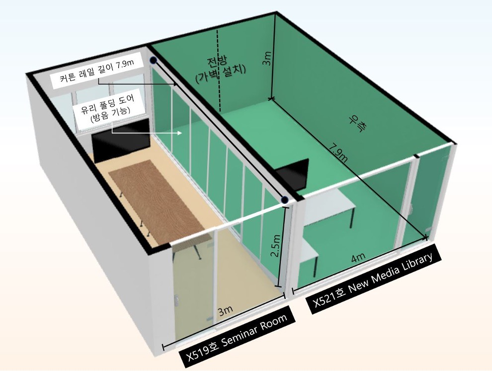
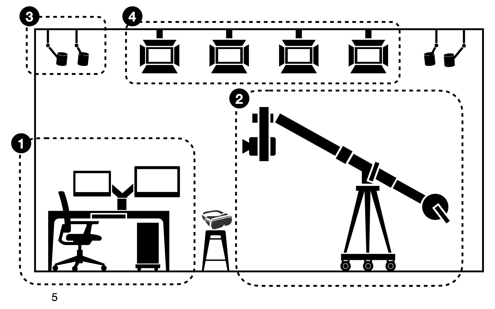
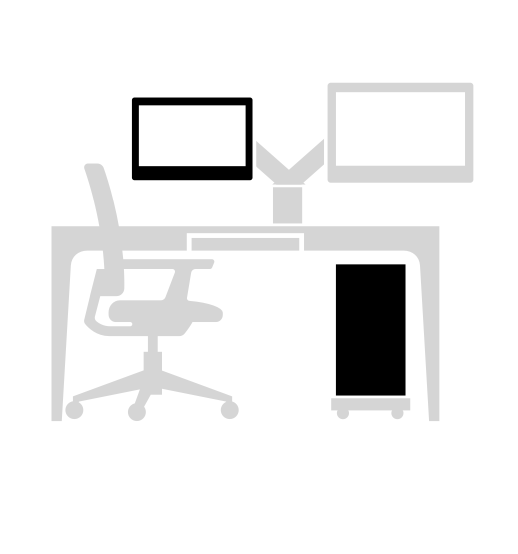
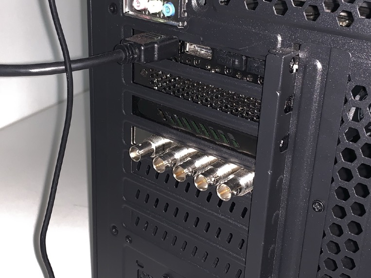
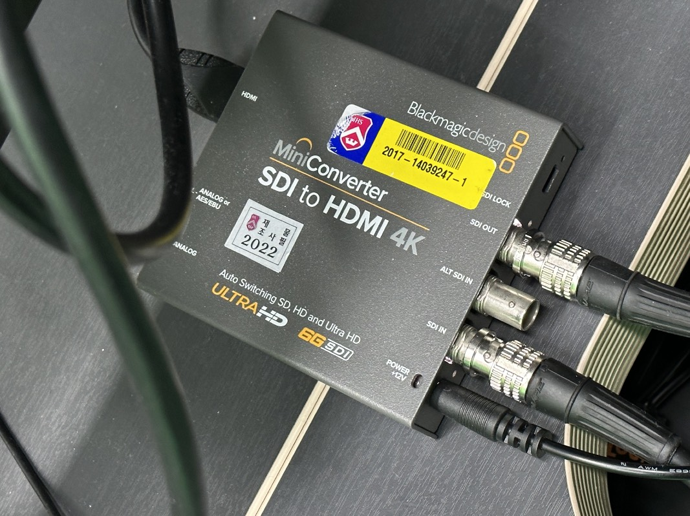

# XR Studio 사용 매뉴얼

## 1. 소개
XR Studio는 전통적인 그린 스크린 크로마키 촬영부터 3D콘텐츠와 실시간 컴포지팅을 활용한 버추얼 프로덕션, 풀바디 모션캡처와 AR/VR 개발 테스트베드 등 각종 콘텐츠 제작과 체험을 위한 다목적 스튜디오입니다.

## 2. 특징
| 특성         | 설명                                                                                                                                                                                                        |
|------------|-----------------------------------------------------------------------------------------------------------------------------------------------------------------------------------------------------------|
| 고성능 PC     | 언리얼 엔진5를 비롯해 가상서계 제작과 실시간 합성에 요구되는 컴퓨팅 파워를 갖춘 고사양 PC를 사용할 수 있습니다.   특히, 실시간 비디오 인/아웃풋 피드를 위해 최대 8K 해상도의 비디오 4채널의 송수신이 가능한 캡처카드가 설치되어 있습니다.   1,000니트의 고휘도 모니터를 통해 실시간 합성결과 확인이 가능합니다.               |
| 4K 촬영 카메라  | 4K급 HDR 60p,FHD급 180p에서 높은 관용도의 고품질 영상을 캡처할 수 있는 고사양 캠코더와 파워줌이 포함된 시네마용 줌렌즈를 사용할 수 있습니다.   외장 레코더를 통해 ProRes 등 전문가용 코덱으로 녹화할 수 있습니다.                                                                   |
| 무빙헤드 지미집 시스템 | 달리인/아웃, 붐업/다운, 스윙 등의 다이나믹한 촬영이 가능하도록 최대 2.8m 길이까지 확장 가능한 달리 지미집이 설치되어있습니다.   특히, 원격 틸트/패닝 조작이 가능하도록 전동 헤드가 설치되었으며 전원 장치 일원화로 촬영간 이동이 용이합니다.                                                            |
| Vive VR 트래킹 시스템 | 간편하고도 정밀한 모션트래킹, VR 콘텐츠 체험을 위한 가장 합리적인 선택지로 HTC Vive VR 시스템이 완비되어있습니다.   Vive Pro, Cosmos Elite 등 고성능 VR HMD 뿐만 아니라 높은 범용성과 정밀도를 자랑하는 Vive Tracker 3.0을 활용해 버추얼 시네마토그라피 외에도 풀바디 모션캡처 등의 다양한 실험이 가능합니다. |
| 스튜디오 조명과 크로마키 월 | 3면을 둘러싼 그린스크린 월과 원활한 크로마 키잉을 위해 고르게 배치된 스튜디오 조명을 사용할 수 있습니다.   추후 업데이트를 통해 모든 조명의 전우너과 밝기 등을 DMX 컨트롤러로 일괄 조정할 수 있습니다.                                                                                  |

## 3. 공간 제원

X521호 W4.0m* D7.9m* H3.0m

(1) XR PC & 콘솔 데스크  
(2) 4K 카메라 & 무빙헤드 지미집 시스템  
(3) Vive VR 트래킹 시스템  
(4) 크로마키 월 & 스튜디오 조명

## 4. 장치 소개

### (1) XR PC
XR 스튜디오를 구동하는 메인 PC.
  카메라 비디오 입력을 받아 언리얼 엔진 등 소프트웨어를 거쳐 합성하는 작업과, 그것을 다시 각종 출력장치로 내보내는 역할을 함.
  또한, XR 스튜디오의 기본 추적 체계로서 Vive VR 시스템을 구동한다.

### (2) Blackmagic Design Decklink 8K Pro

PC에서 외부 카메라 입력, 외부 모니터 출력 등을 가능하게 하는 PCle 비디오 카드 별도의 USB 캡처 카드나 그래픽카드를 거치지 않고, 4개의 12G-SDI 규격 단자를 통해 최대 8K 해상도 영상을 양방향 전송할 수 있다.
#### 장치소개 및 매뉴얼: 
https://www.blackmagicdesign.com/products/decklink/techspecs/W-DLK-45

### (3) Lilliput PVM 210S 모니터

실시간 합성 또는 송출 화면을 모니터링하기 위한 디스플레이, 일반 PC 모니터와 달리 3G-SDI 입력과 Loop Out 출력을 지원하며, 그외에도 HDMI와 VGA, AV단자 입력으로도 사용할 수 있다.
  FHD 해상도, sRGB 색역 101% 지원, 최대 1,000nit의 밝기로 모니터링할 수 있다.
#### 장치소개 및 매뉴얼:
https://tsisystem.co.kr/shop_view/?idx=539

### (4) MiniConverter/MicroConverter
XR PC의 Decklink를 통해 출력되는 SDI 규격 신호를 다른 규격(HDMI 등)으로 변환하고 다양한 외부 기기로 전송할 수 있도록 하는 장치.
  공통적으로 입력된 SDI 신호를 복제해서 다시 출력시키는 Loop Out 기능을 지원한다.
- Miniconverter : SDI to HDMI 4K

### Sony FS7||
XR스튜디오의 메인 카메라.
4K Super 35mm 센서 규격의 전문 캠코더로, 캠코더의 XQD카드를 활용하면 최대 DCI-4K(4096*2160) 59.94p 영상을 XAVCI
코덱(600Mbps)으로 녹화할 수 있으며,
현재 XR스튜디오에 설치된 구성대로도 최대 DCI-4K 59.94p 영상을 PC로 실시간 입력할 수 있다.
5-log 지원, 가변ND필터 등 기능을 이용해 전문적인 영상 작업을 수행할 수 있다.
장치소개 및 매뉴얼:https://pro.sony/ko KR/support-resources/pxw-fs7m2/manual

### Sony 18-110mm F4 GOSS
현재 FS7I캠코더에 연결된 기본렌즈.
18mm 광각부터 110mm 망원까지의 넓은 화각대를 커버하는 줌렌즈로, 전동식 줌, 광학식 손떨림 보정 기능, 무단 조리개링 등 전문적인 영상 작업에 최적화 되어 있다.

### Atomos Shogun Inferno
모니터 레코더
XR스튜디오의 메인 카메라를 통해 촬영되는 상을 실시간 모니터링하고, PC로의 SDI 또는 HDMI 케이블 연결을 지원하며, 탈부착 가능한 SSD를 통해 카메라로부터 받아온 영상 입력을 다양한 외부 포맷으로 녹화할 수 있는 모니터 레코더.
장치소개 및 매뉴얼:https://downloads.atomos.com/shogun-inferno/Shogun Inferno_ User Manual.pdf
좌측면
후면
우측면
모니터 캘리브레이션용 2.5mm 단자
전원버튼
SSD 장착 틀
듀얼 배터리 슬롯
ATOMOS
오디오 출력용
3.5mm 단자
HDMI입력 단자
HDMI 출력 단자
DC전원단자
오디오 입력용
아날로그 단자
3G-SDI 입력단자 *3
12GSDI 입력단자
12G-SDI 출력단자 젠락/타임코드 입력단자

XR스튜디오의 메인 카메라를 통해 촬영되는 상을 실시간 모니터링하고, PC로의 SDI 또는 HDMI 케이블 연결을 지원하며, 탈부착 가능한 SSD를 통해 카메라로부터 받아온 영상 입력을 다양한 외부 포맷으로 녹화할 수 있는 모니터 레코더.
장치소개 및 매뉴얼:https://downloads.atomos.com/shogun-inferno/Shogun Inferno_ User Manual.pdf

모니터 레코더용SSD는 탈착 후
스튜디오 내에 비치된 SATA to USB C 어댑터를 통해 파일 백업이 가능하다.

### 벤로 MoveUp20 지미집 시스템
지미집 본체 MoveUp20+ 전동드 MUC10+ 삼각대 AS04S+ 바퀴달리 DL10
XR스튜디오의 메인 카메라를 자유롭게 움직이기 위한 지미집 시스템.
MUC10 전동 모터헤드를 탑재해 카메라의 패닝과 틸트를 조작할 수 있다.
또한 지미집 길이는 최대 2780mm까지 연장해 더 큰 무빙을 주는 데 활용할 수 있다.

수평 안전 잠금 레버
모터헤드 컨트롤러 전원 스위치
패닝/ 틸트 방향 설정 스위치 패닝/ 틸트 속도 설정 노브
패닝/틸트 댐핑 설정 노브
틸트 고정 레버
팬고정 레버
패닝/ 틸트 조이스틱

### iveVR 트래킹 시스템
XR스튜디오 내 트래킹을 수행하기 위해 설치된 Vive의 VR시스템.
Base Station이 설치된 공간 내에서는 HMD와 컨트롤러 뿐 아니라 Vive Tracker를 정밀하게 추적해 다양한 버추얼 프로덕션과 모션트래킹 작업에 활용할 수 있다.

## Base Station 2.0*4
트래킹 영역을 형성하기 위해 스튜디오 천장의 네 모서리에 설치되어있다.
4채널 설치로 최대 10m * 10m의 단일 트래킹 범위를 형성할 수 있다.
*제한된 범위에서의 트래킹은 캐비넷에 보관된 Base Station 1.0의 2채널 설치로도 가능하다.
이때에는 트래킹 영역이 최대 5m * 5m로 제한된다.
## Vive Tracker 3.0
Base Station으로 형성된 영역 내에서 움직임을 트래킹할 수 있는 장비.
XR스튜디오 내 버추얼 프로덕션을 위해 카메라에 설치되어있고, 그 외에도 모션 캡처나 다양한 용도로 활용될 수 있다.

### Vive VR 트래킹 시스템
XR스튜디오 내 트래킹을 수행하기 위해 설치된 Vive의 VR시스템.
Base Station이 설치된 공간 내에서는 HMD와 컨트롤러 뿐 아니라 Vive Tracker를 정밀하게 추적해 다양한 버추얼 프로덕션과 모션트래킹 작업에 활용할 수 있다.

#### Vive Pro HMD & Controllers
XR스튜디오 내 Vive 트래킹을 위해 기본적으로 설치된 HMD.
SteamVR 게임 체험 및 개발을 위해 사용할 수도 있다.
OLED 3.5 2x 1440 x 1600 90Hz 디스플레이/ 시야각 110도

#### Vive Cosmos Elite HMD & Controllers
XR스튜디오 내에 부가적으로 구비된 HMD.
SteamVR 게임 체험 및 개발을 위해 사용할 수도 있다.
LCD 3.4" 2x 1440 x 1700 90Hz 디스플레이/ 시야각 110도

### XR PC
- CPU : i7-10900k
- Mainboard : AsRock B460M Pro4
- RAM: DDR4-3200 64GB (16GB*4)
- Graphics: MSI RTX3080 10GB
- Storage: 
  - Samsung 980 M.2 NVMe SSD 500GB
  - WD Blue 3D SATA3 SSD 500GB
  - Toshiba P300 7200/64M 2TB
- Capture Card: Blackmagic Design Decklink 8K Pro
- Monitor: BenQ EW2780Q / Lilliput PVM210S

### 4K 촬영 카메라
- Body: Sony PXW-F57m2 w/ Sony XQD Card 240GB
- Lens: Sony E PZ 18-110mm F4 GOSS

### 무빙헤드 지미집 시스템
- Mini Jib: Benro MoveUp20 (A20J27)
- Tripod: Benro AS14
- Dolly: Benro DL10
- Motor Head: Benro MUC10
- Monitor/Recorder: Atomos Shogun Inferno w/ Samsung 870 EVO SSD 1TB
- Battery Pinch: Lanparte VBP-01
- Counterweight: Melkin Chrome Barbell Disk 10kg*2

### Vive VR 시스템
- HTC Vive Pro / HTC Vive Cosmos Elite
- Base Station 2.0*4
- Vive Tracker 3.0

### 조명
- SH-LED-FLUX150*6

### Data Flow
다음은 현재 XR스튜디오의 장비와 Unreal Engine 내장 플러그 인만을 활용해 기초적인 영상 합성 작업이 이뤄지는 흐름입니다.
이외에도 다양한 프로그램을 활용해 사용자의 니즈에 맞는 버추 얼프로덕션 구성이 가능합니다.
1. 스튜디오 내에 설치된 4개의 Vive Base Station 2.0을 통해 최 대 10m*10m의 'stage'를 형성하고, Vive Tracker 3.0을 카메 라에 부착해 카메라의 X,Y,Z값을 실시간으로 추적함.
2. 동시에, 카메라를 통해 촬영되는 영상이 실시간으로 PC의 Decklink를 통해 전송되어 Unreal Engine에서 크로마 키잉 이 적용됨.
3. 실시간으로 추적되는 카메라의 위치값이 Unreal Engine상의 가상카메라와 동기화되고,
4. 결과적으로 가상 3D 콘텐츠 위에 카메라 촬영본이 합성되어 다시 Decklink를 통해 Composite Monitor에 송출됨.
5. Composite Monitor에서 Loop Out되어 나오는 합성 영상은 Monitor/Recorder로 전송되어 다양한 코덱으로 최종 녹화될 수 있음.

### Power Flow
다음은 현재 XR스튜디오의 장비의 전원 연결 상태를 보여주는 요약도입니다.
필요에 따라 개별적인 전원 연결을 바꾸 는 것은 가능하나, XR 스튜디오의 제한된 콘센트 수와 각 멀티탭별 균등한 전력 분 배를 고려해 다음 셋팅대로 이용할 것을 권장합니다.

### 전원켜기
본 매뉴얼의 여타 장치들은 켜고 끄는 순서가 조금 달라져도 무방하지만, 언제나 카메라는 가장 마지막에 켜고 가장 먼저 끌 것을 권장합니다.
1. 스튜디오 조명과 Base Station 켜기
   - 스튜디오 진입 후 우측에 길게 내려와있는 멀티탭 코드선을 확인 
   - 우측 벽면 하단부의 콘센트 중 상시전원 단자에 코드선을 꽂으면 일괄적으로 천장 메쉬에 설치된 모든 조명과 Base Station에 전원이 인가됨.
2. 데스크 멀티탭과 PC 켜기
   - 모션데스크 후면의 멀티탭 전원을 켜기
   - PC 파워 버튼을 켜고, 전면 전원을 켜기
   3. 지미집 모터헤드 컨트롤러 켜기
   - 지미집 모터헤드 컨트롤러 상단의 빨간색 로커스위치를 확인
   - 눌러서 파란 불이 들어오면 컨트롤러에 전원이 인가되며, 조이스틱으로 모터헤드를 조작할 수 있음.
4. Shogun Inferno 모니터 레코더 켜기
   - 모니터 레코더 우측면의 전원버튼을 3초간 누르면 팬이 돌며 켜짐.
5. FS7 II 카메라 켜기
   - FS7 II 카메라의 좌측면 하단부의 전원 스위치를 킬 것
스튜디오 사용 후 반드시 켜는 순서의 역순으로 모든 전원을 꺼주세요.

### 카메라 기본 설정

- VBP-01 배터리 핀치의 AC전원 연결 상태를 확인
- VBP-01 배터리의 [For Camera] [12V 전원 출력 ~ FS7 II의 DC전원 사이 연결 상태를 확인
현재 XR 스튜디오의 FS7 II는 사용 편의를 위해 배터리를 사용하지 않고 지미집에 설치된 배터리 핀치로부터 DC전원을 유선으로 공급받고 있음.
카메라 사용 전 해당 연결 상태를 꼭 확인할 것.
배터리 사용을 원할 시, DC전원 연결을 해제하고 스튜디오 내에 보관된 BP-U30 배터리를 체결할 것 (*학과 FS5 캠코더와 호환)

#### 기본설정
- FS7 II 캠코더의 [메뉴]를 눌러 [사용자]설정에 진입
- [기본설정]의 [촬영 모드], [색공간]을 확인

촬영모드는 Cine EL와 커스텀으로 나뉨.
Cine El: 필름카메라 방식. 후반작업을 전제로 최대의 다이나믹 레인지를 끌어낼 수 있도록
exposure index를 활용함. Log 감마 촬영이 기본 설정.
커스텀: 일반 TV 디스플레이용 컬러를 구현. 후반작업 없이 현장에서 편리한 촬영 가능.
본 매뉴얼에서는 커스텀 모드 사용을 권장함.

#### 녹화형식
- [녹화형식]의 [비디오 형식]을 확인

FS7 II 카메라는1920*1080 23.98p부터 4096*2160 59.94p까지 다양한 해상도에서 다양한 프레임수 촬영을 지원함.
본 매뉴얼에서는 3840*2160 59.94p 사용을 권장함.

#### 코덱
- [코덱]을 확인

코덱은 XAVC-I와 XAVC-L,MPEG HD422로 나뉨.
XAVC-1: 고품질, 저압축(고용량). 10bit 4:2:2 코덱. 전 해상도에서 촬영 가능.
XAVC-L: 고품질, 고압축(저용량). 10bit/8bit 4:2:2 코덱. 전 해상도에서 촬영 가능.
MPEG HD422: 저품질, 고압축(저용량). 8but 4:2:2 코덱. 1080 해상도만 촬영 가능.

코덱 설정은 카메라 메모리에 녹화할 경우에만 적용되는 설정으로, 버추얼 프로덕션 등 용도에서 PC로 연결하거나 모니터레코더로 녹화할 경우 해당사항 없음.

#### 카메라 메모리-XQD카드 (240GB)
- FS7 II의 메모리 슬롯을 확인

카메라 메모리로 직접 녹화할 경우 사용하는 저장매체.
현재 카메라에는 240GB 용량의 XQD카드를 사용중이며, 스튜디오에 보관된 XQD 카드 리더기를 통해 파일 백업이 가능함.
  
이 역시 버추얼 프로덕션 등의 용도에서 PC 연결 또는 모니터레코더를 사용해 녹화할 경우 사용하지 않음.

### 카메라 to PC 연결 방법
본 매뉴얼에서는 카메라(FS7 I) 기준 최대 해상도 & 최대 프레임수인 4K 59.54p를 기준으로 설정하는 법을 안내하고 있습니다.
필요에 따라 다른 해상도와 프레임수를 설정해주어도 무방합니다.
단, 카메라 설정과 모니터/레코더 설정, 컴퓨터 입력단의 설정을 모두 같은 해상도와 프레임수로 통일시켜주는 것이 중요합니다.

1. 카메라 설정하기
- FS7 II 캠코더의 [메뉴]를 눌러 설정에 진입
- [비디오] 설정의 [출력 켬/끔]에서 SDI와 HDMI를 모두 [켬]으로 설정

본 매뉴얼의 기본 설정상으로는 HDMI 출력만을 우선적으로 사용하나, 혹시 모를 상황에 대비해 차선책으로 SDI 출력 또한 연결 및 설정하도록 함.
- [출력 형식]에서 HDMI 해상도를 [3840x 2160P]로 설정

차선책으로 SDI 출력 사용할 경우, SDI를 [1920 x 1080P (Level A)]로 설정해 사용할 것.
2. 카메라와 모니터 연결하기
- FS7 II 캠코더의 우측 후면 입출력 단자를 확인
- [SDI OUT 2] 단자에 SDI 케이블이, [HDMI] 단자에 HDMI 케이블이 잘 체결되었는지 확인

본 매뉴얼의 기본 설정에 따라 HDMI 출력을 사용할 경우, SDI 케이블은 연결하지 않아도 됨
- 지미집 중앙부에 설치된 Shogun Inferno 모니터/레코더의 측면부를 확인
- [HDMI IN] 단자에 HDMI케이블이 잘 체결되었는지 확인

3. 모니터/레코드 설정하기
- Shogun Inferno 모니터/레코더 화면의 좌측 상단을 확인
- [HDMI/AKUHDp59.94]로 설정되어있는지 확인
- 화면 좌측 상단을 터치하면 세부 설정이 가능함
- [SOURCE]가 [HDMI 4KUHDp 59.94]로 설정되어있는지 확인

차선책으로 카메라의 SDI 출력을 사용할 경우, [SOURCE]를 다시 터치해 입력 소스를 바꿔줄 것

4. 모니터와 레코드 연결하기
- Shogun Inferno 모니터/레코더의 후면 하단을 확인
- SDI [OUT] 단자에 SDI 케이블이 잘 체결되었는지 확인
차선책으로 카메라의 SD 출력을 사용할 경우, 카메라로부터 연결된 SDI 케이블을 좌측의 SDI [IN] 단자에 체결할 것
- PC 후면의 Decklink 입출력 단자를 확인
- Shogun Inferno 모니터/레코더로부터 연결된 SDI 케이블을 [1]번 단자에 체결할 것 (입력)
- [4]번 단자에 체결된 SDI 케이블이 메인 데스크의 Live Composite Monitor로 연결되었는지 확인

단자 번호 자체는 좌측에서부터 [1], [2], [3], [4]번이지만, 알 수 없는 이유로 커넥터 매핑이 [1], [3], [2], [4] 순으로 되어있음.

5. PC 설정하기
- PC에 설치된 [Desktop Video Setup] [Blackmagic Media Express] 프로그램을 활용해 Decklink 입출력 단자를 설정하고, 카메라로부터 입력되는 소스를 미리 확인할 수 있음.
- [Desktop Video Setup] 프로그램을 통해 Decklink의 4개 단자마다 연결 설정을 해줄 수 있음.
- 필요에 따라 적절하게 설정하면 되지만, 본 매뉴얼의 권장 기본설정은 다음과 같음.
  - 4개 단자 모두 [In or Out]
  - 카메라와 연결된 [1]번 단자는 [2160p59.94]
  - 외부 모니터와 연결된 [4]번 단자는 [1080p59.54]

### Vive VR
1. 트래킹 영역 확보하기
- XR스튜디오에는 현재 기본적으로 4대의 Base Station 2.0이 천장 메쉬에 설치되어 있으며, 아래 가이드라인에 부합한다면 변동 없이 그대로 사용해도 무방함.
- 옆 호실(Seminar Room)을 확장해서 사용할 경우, 2대의 Base Station을 스탠드로 이동해 설치하면 더 넓은 트래킹 영역을 형성할 수 있음 (최대 10m* 10m)
- 각 Base Station은 150의 수평 시야각과 110°의 수직 시야각을 가지고 있으며, HMD/컨트롤러/트래커가 어느 Base Station으로부터든 7m 이내의 거리에 장애물 없이 위치해있어야 원활한 트래킹이 가능함.
- 최소 2m 이상의 높이에서, 25°~35° 아래로 기울인 채로 서로 다른 Base Station끼리 일정 수준 마주볼 수 있도록 설치할 것을 권장
2. Steam VR 프로그램 켜기
- Vive VR 시스템 내 기기들을 페어링하고 모니터링할 수 있는 Steam VR 프로그램을 XR PC에서 열기
- PC 화면 우측 하단에 다음과 같은 창을 확인
- HMD, 컨트롤러, Base Station 2.0 4개, 트래커까지 모두 잡힌다면 바로 작업 착수 가능함.
  잡히지 않은 기기가 있다면 다음 단계를 따를 것
3. Vive HMD와 컨트롤러, 트래커 연결하기
- Vive 기본 설정상으로 HMD 없이 트래커만 사용할 수는 없으므로, XR 스튜디오 내 트래킹을 활성화하기 위해선 HMD를 사용하지 않더라도 연결 설정을 마쳐야 함.
- Vive Pro HMD를 스튜디오 바닥에 내려놓고,
  - HMD단과 PC단을 모두 Linkbox에 연결해준 뒤 
  - 파워 버튼을 눌러 전원을 켜기
- Vive Controller는 충전이 완료된 상태에서 (Micro USB 5핀 충전)
  중앙의 시스템 버튼을 한 번 눌러서 전원을 켜기
- Vive Tracker는 충전이 완료된 상태에서 (USBC 충전) 중앙의 전원 버튼을 5초간 눌러서 전원을 켜기
- 중앙의 상태표시등이 녹색으로 변하면 PC의 Steam VR앱과 페어링되었다는 의미임

충전과 동시에 사용할 수 없으므로 사용 전 완충해둘 것
- Vive Tracker와 컨트롤러를 동시에 사용할 경우, Tracker용 USB 동글이 PC에 연결되어야 함
- PC와 동글 사이 최소 45cm의 거리를 유지할 것
- 좌측 사진과 같이 HMD, 컨트롤러, 4개의 Base Station, 그리고 트래커까지 인식하면 연결 완료
- 좌측의 컨트롤러 아이콘에서 보이듯 HMD, 컨트롤러, 트래커는 유휴시간이 길어지면 대기모드로 들어가면서 인식되지 않고 아이콘이 어두워짐. 작업 개시 전 모든 기기가 깨어있는지 확인해야 함.

4. 룸셋업
- 트래킹 영역을 설정하는 룸 셋업을 실시
- Steam VR을 통해 게임 등 활동을 한다면 [ROOM-SCALE]로 스튜디오 내 걸어다닐 수 있는 공간을 직접 인식시켜주어야 함
- 외부 소프트웨어를 통한 트래킹 작업만 한다면 [STANDING ONLY]로 고정된 위치를 인식시켜도 무방함
- 셋업을 마친 후, OpenVR 플러그인을 통한 트래킹 옵션을 제공하는 각종 소프트웨어와 연계해 버추얼 프로덕션 및 모션캡처 등 작업이 가능함.
- 구체적인 Vive VR 페어링 및 셋팅 방법은 학과 기자재 중 VR자비(Vive Pro) 사용자 교육 자료를 참고할 것

### 버츄얼 프로덕션 예시 요약도

다음은 XR 스튜디오의 그린 스크린과 트래킹 시스템을 활용해 버추얼 프로덕션을 구현하는 방법을 요약한 그림입니다.
언리얼 엔진 내장플로그인을 활용하는 방법과, Aximmetry 등의 합성 소프트웨어를 사용하는 방법 등이 다양하게 있으므로 필요에 따라 적절히활용하면 됩니다.

### 유의사항
- 스튜디오의 크로마키 월이 오염되지 않도록 반드시 실내화를 착용하십시오.
- 각종 장치의 설정을 변경한 후에는 반드시 원상복구하십시오.
- 스튜디오 내 장비를 무단으로 반출하지 마십시오.
- 사용을 마친 후에는 반드시 전원을 모두 끄고 퇴실하십시오.
- 옆 호실(Seminar Room)을 확장해 사용한 경우, 반드시 모든 문을 닫고 잠근 후 퇴실하십시오.
- PC와 각종 저장장치는 주기적으로 포맷되므로 개인 자료는 미리 백업하십시오
- 안전사고 주의
  - 지미집 사용시 부딪힘 사고를 주의할 것
    - XR스튜디오에 설치된 지미집은 금속제에 부피가 크고 양쪽으로 20kg이 넘는 무게가 달린 물체로, 운용시나 통행시에 부딪히거나 물체가 떨어짐으로 인해 큰 사고가 일어날 위험이 있으므로 각별히 주의해야 함.
    - 또한, 좌우/상하로 지미집을 움직이다가 다른 기자재를 파손할 위험이 있으므로, 주변을 미리 살필 수 있도록 지미집 운용 시에 스튜디오에 2인 이상 상주할 것을 강력히 권장함.
  - 케이블 단선, 걸려 넘어짐 사고를 주의할 것
    - XR스튜디오에는 많은 케이블이 설치되어있어 통행시에 케이블을 밟거나 걸려 넘어질 위험이 있으므로 각별히 주의해야 함.
    - 케이블의 내구도와 사고 방지를 위해 되도록 케이블을 직접 밟지 않도록 주의해야 함.
  - 천장 메쉬 작업시 낙상사고에 주의할 것
    - 되도록 천장 메쉬에 설치된 장치를 건들지 말고, 꼭 필요한 경우에는 반드시 사다리 밑에서 보조할 인원을 구할 것.

제작 아텍 17 류권우

