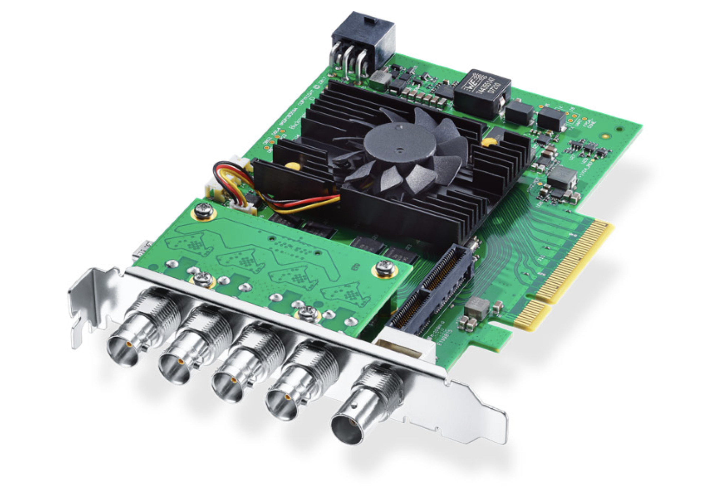
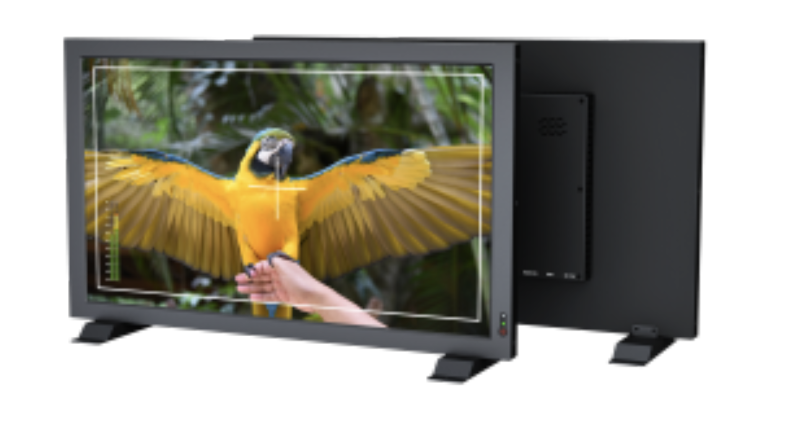
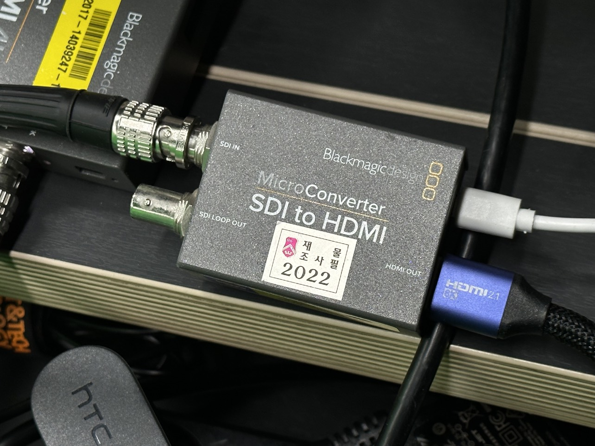
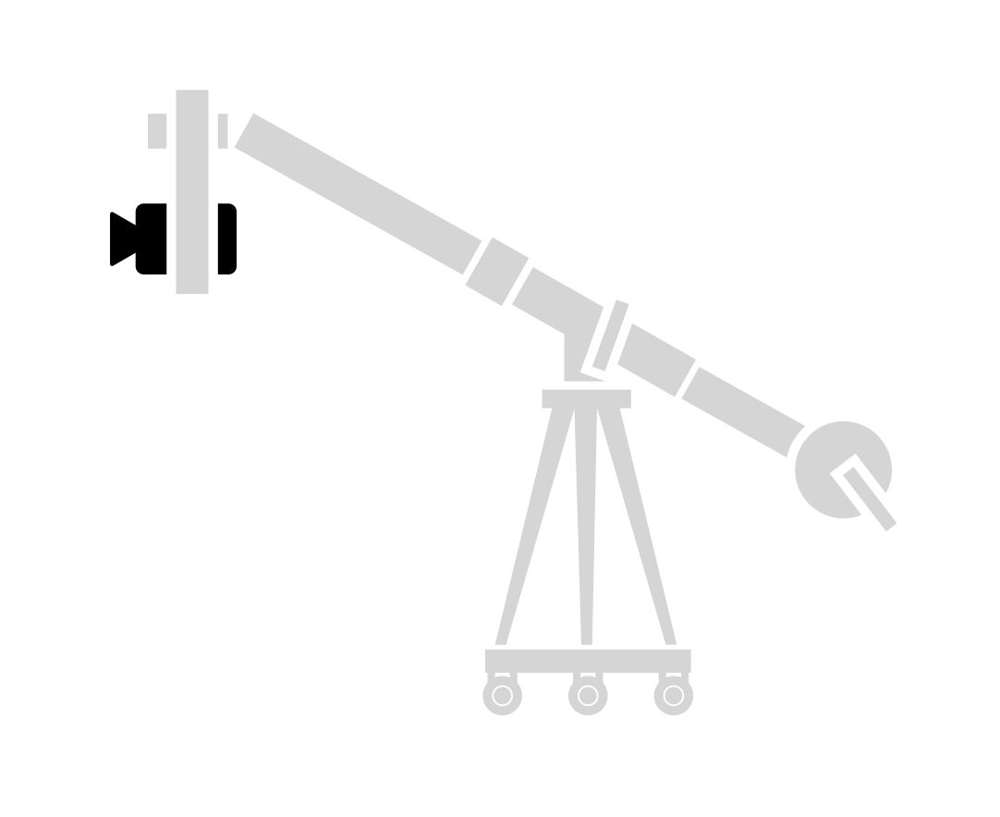

# XR Studio 사용 매뉴얼

## 1. 소개
XR Studio는 전통적인 그린 스크린 크로마키 촬영부터 3D콘텐츠와 실시간 컴포지팅을 활용한 버추얼 프로덕션, 풀바디 모션캡처와 AR/VR 개발 테스트베드 등 각종 콘텐츠 제작과 체험을 위한 다목적 스튜디오입니다.

## 2. 특징
| 특성         | 설명                                                                                                                                                                                                        |
|------------|-----------------------------------------------------------------------------------------------------------------------------------------------------------------------------------------------------------|
| 고성능 PC     | 언리얼 엔진5를 비롯해 가상서계 제작과 실시간 합성에 요구되는 컴퓨팅 파워를 갖춘 고사양 PC를 사용할 수 있습니다.   특히, 실시간 비디오 인/아웃풋 피드를 위해 최대 8K 해상도의 비디오 4채널의 송수신이 가능한 캡처카드가 설치되어 있습니다.   1,000니트의 고휘도 모니터를 통해 실시간 합성결과 확인이 가능합니다.               |
| 4K 촬영 카메라  | 4K급 HDR 60p,FHD급 180p에서 높은 관용도의 고품질 영상을 캡처할 수 있는 고사양 캠코더와 파워줌이 포함된 시네마용 줌렌즈를 사용할 수 있습니다.   외장 레코더를 통해 ProRes 등 전문가용 코덱으로 녹화할 수 있습니다.                                                                   |
| 무빙헤드 지미집 시스템 | 달리인/아웃, 붐업/다운, 스윙 등의 다이나믹한 촬영이 가능하도록 최대 2.8m 길이까지 확장 가능한 달리 지미집이 설치되어있습니다.   특히, 원격 틸트/패닝 조작이 가능하도록 전동 헤드가 설치되었으며 전원 장치 일원화로 촬영간 이동이 용이합니다.                                                            |
| Vive VR 트래킹 시스템 | 간편하고도 정밀한 모션트래킹, VR 콘텐츠 체험을 위한 가장 합리적인 선택지로 HTC Vive VR 시스템이 완비되어있습니다.   Vive Pro, Cosmos Elite 등 고성능 VR HMD 뿐만 아니라 높은 범용성과 정밀도를 자랑하는 Vive Tracker 3.0을 활용해 버추얼 시네마토그라피 외에도 풀바디 모션캡처 등의 다양한 실험이 가능합니다. |
| 스튜디오 조명과 크로마키 월 | 3면을 둘러싼 그린스크린 월과 원활한 크로마 키잉을 위해 고르게 배치된 스튜디오 조명을 사용할 수 있습니다.   추후 업데이트를 통해 모든 조명의 전우너과 밝기 등을 DMX 컨트롤러로 일괄 조정할 수 있습니다.                                                                                  |

## 3. 공간 제원

X521호 W4.0m* D7.9m* H3.0m

(1) XR PC & 콘솔 데스크  
(2) 4K 카메라 & 무빙헤드 지미집 시스템  
(3) Vive VR 트래킹 시스템  
(4) 크로마키 월 & 스튜디오 조명

## 4. 장치 소개
>
> >### (1) XR PC
> > XR 스튜디오를 구동하는 메인 PC.
> >   카메라 비디오 입력을 받아 언리얼 엔진 등 소프트웨어를 거쳐 합성하는 작업과, 그것을 다시 각종 출력장치로 내보내는 역할을 함.
> >   또한, XR 스튜디오의 기본 추적 체계로서 Vive VR 시스템을 구동한다.
>
> >### (2) Blackmagic Design Decklink 8K Pro
> > 
> > 
> > PC에서 외부 카메라 입력, 외부 모니터 출력 등을 가능하게 하는 PCle 비디오 카드 별도의 USB 캡처 카드나 그래픽카드를 거치지 않고, 4개의 12G-SDI 규격 단자를 통해 최대 8K 해상도 영상을 양방향 전송할 수 있다.
> > #### 장치소개 및 매뉴얼: https://www.blackmagicdesign.com/products/decklink/techspecs/W-DLK-45
>
> > ### (3) Lilliput PVM 210S 모니터
> > 
> >   실시간 합성 또는 송출 화면을 모니터링하기 위한 디스플레이, 일반 PC 모니터와 달리 3G-SDI 입력과 Loop Out 출력을 지원하며, 그외에도 HDMI와 VGA, AV단자 입력으로도 사용할 수 있다.
> >   FHD 해상도, sRGB 색역 101% 지원, 최대 1,000nit의 밝기로 모니터링할 수 있다.
> > #### 장치소개 및 매뉴얼: https://tsisystem.co.kr/shop_view/?idx=539
>
> > ### (4) MiniConverter/MicroConverter
> > XR PC의 Decklink를 통해 출력되는 SDI 규격 신호를 다른 규격(HDMI 등)으로 변환하고 다양한 외부 기기로 전송할 수 있도록 하는 장치.
> >   공통적으로 입력된 SDI 신호를 복제해서 다시 출력시키는 Loop Out 기능을 지원한다.
> > >- Miniconverter : SDI to HDMI 4K
> > >
> > > SDI 입력: 1xSD, HD, 6G-SDI 규격 / 1xALT SDI (예비용 입력)
> > >   SDI 출력: 1xLoop Out (입력 복제)
> > >   HDMI 출력: 1x타입A
> > >   오디오 출력: 2채널 아날로그 오디오(1/4") 또는 AES/EBU 디지털 오디오
> > > #### 장치소개 및 매뉴얼: https://www.blackmagicdesign.com/api/print/to-pdf/products/miniconverters/techspecs/W-CONM-26?filename=mini-converter-sdi-to-hdmi-6g-techspecs.pdf
> > 
> > > - MicroConverter - SDI to HDMI
> > > 
> > > SDI 입력: 1xSD, HD, 3G-SDI 규격
> > > SDI 출력 1xLoop Out (입력 복제)
> > > HDMI 출력: 1x타입A
> > > #### 장치소개 및 매뉴얼: https://www.blackmagicdesign.com/api/print/to-pdf/products/microconverters/techspecs/W-CONU-12?filename=micro-converter-sdi-to-hdmi-3g-techspecs.pdf

> 
> > ### (1) Sony FS72 캠코더
> > XR 스튜디오의 메인 카메라. 4K Super 35mm 센서 규격의 전문 캠코더로, 캠코더의 XQD카드를 활용하면 최대 DCI-4K(4096*2160) 59.94p 영상을 XAVC I 코덱(600Mbps)으로 녹화할 수 있으며, 현재 XR 스튜디오에 설치된 구성대로도 최대 DCI-4K 59.94p 영상을 PC로 실시간 입력할 수 있다.
> > S-log 지언, 가변ND필터 등 기능을 이용해 전문적인 영상 작업을 수행할 수 있다.
> > #### 장치소개 및 매뉴얼: https://www.sony.co.kr/electronics/support/professional-camcorders-handheld-camcorders/pxw-fs7m2/manuals
> 
> > ### (2) Sony 18-110mm F4 G OSS 렌즈
> > 현재 FS72 캠코더에 연결된 기본 렌즈.
> >   18mm 광각부터 110mm 망원까지의 넓은 화각대를 커버하는 줌렌즈로, 전동식 줌, 광학식 손떨림 보정 기능, 무단 조리개링 등 전문적인 영상 작업에 최적화되어 있다.

